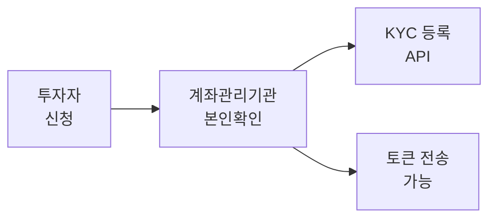

# KYC API

KYC(Know Your Customer) API는 지갑 주소의 본인확인 등록 상태를 관리합니다. KYC 등록된 주소만 토큰 전송이 가능합니다.

---

## KYC 등록

여러 지갑 주소를 한 번에 KYC 등록합니다.

### Request

```bash
POST /main/v1/kyc/{tokenSymbol}
```

<ParamField path="tokenSymbol" type="string" required>
  토큰 심볼 (DT 토큰일 경우 `DT`)
</ParamField>

### Headers

| Header | Type | Description |
|--------|------|-------------|
| `Authorization` | string | Bearer {access_token} |

### Request Body

지갑 주소 배열을 전송합니다:

```json
[
  "0xAdb6Dc93FF5d5d93998e1643A03048C5437B08B7",
  "0xFE3B557E8Fb62b89F4916B721be55cEb828dBd73"
]
```

### Example

<CodeGroup>

```bash cURL
curl -X POST "https://api.stopulse.co.kr/main/v1/kyc/PULSE-ST-001" \
  -H "Authorization: Bearer {access_token}" \
  -H "Content-Type: application/json" \
  -d '[
    "0xAdb6Dc93FF5d5d93998e1643A03048C5437B08B7"
  ]'
```

```javascript JavaScript
const response = await fetch(
  'https://api.stopulse.co.kr/main/v1/kyc/PULSE-ST-001',
  {
    method: 'POST',
    headers: {
      'Authorization': 'Bearer {access_token}',
      'Content-Type': 'application/json'
    },
    body: JSON.stringify([
      '0xAdb6Dc93FF5d5d93998e1643A03048C5437B08B7'
    ])
  }
);
```

```python Python
import requests

url = "https://api.stopulse.co.kr/main/v1/kyc/PULSE-ST-001"
headers = {
    "Authorization": "Bearer {access_token}",
    "Content-Type": "application/json"
}
data = [
    "0xAdb6Dc93FF5d5d93998e1643A03048C5437B08B7"
]

response = requests.post(url, headers=headers, json=data)
```

</CodeGroup>

### Response

```json 201
{
  "transactionHash": "0x33e17615f35f403fab968d536a44ffc37fee8006c3269bfa3401cd53eea0eb86",
  "requestId": "KYC:da9c32e8-9d89-45b0-aee2-8b56e1c65189"
}
```

<ResponseField name="transactionHash" type="string">
  블록체인 트랜잭션 해시
</ResponseField>

<ResponseField name="requestId" type="string">
  요청 ID (형식: `KYC:{uuid}`)
</ResponseField>

---

## KYC 해제

지갑 주소의 KYC 등록을 해제합니다. 해제 후 해당 주소로의 토큰 전송이 불가능해집니다.

### Request

```bash
DELETE /main/v1/kyc/{tokenSymbol}/{holder}
```

<ParamField path="tokenSymbol" type="string" required>
  토큰 심볼
</ParamField>

<ParamField path="holder" type="string" required>
  KYC 해제할 지갑 주소
</ParamField>

### Example

<CodeGroup>

```bash cURL
curl -X DELETE "https://api.stopulse.co.kr/main/v1/kyc/PULSE-ST-001/0xAdb6Dc93FF5d5d93998e1643A03048C5437B08B7" \
  -H "Authorization: Bearer {access_token}"
```

```javascript JavaScript
const response = await fetch(
  'https://api.stopulse.co.kr/main/v1/kyc/PULSE-ST-001/0xAdb6Dc93FF5d5d93998e1643A03048C5437B08B7',
  {
    method: 'DELETE',
    headers: {
      'Authorization': 'Bearer {access_token}'
    }
  }
);
```

</CodeGroup>

### Response

```json 200
{
  "transactionHash": "0xdef456...",
  "requestId": "KYC:789012ab-cdef-..."
}
```

---

## KYC 등록 상태 확인

특정 지갑의 KYC 등록 상태를 조회합니다.

### Request

```bash
GET /main/v1/kyc/{tokenSymbol}/{holder}/check
```

<ParamField path="tokenSymbol" type="string" required>
  토큰 심볼
</ParamField>

<ParamField path="holder" type="string" required>
  확인할 지갑 주소
</ParamField>

### Example

<CodeGroup>

```bash cURL
curl -X GET "https://api.stopulse.co.kr/main/v1/kyc/PULSE-ST-001/0xAdb6Dc93FF5d5d93998e1643A03048C5437B08B7/check" \
  -H "Authorization: Bearer {access_token}"
```

```javascript JavaScript
const response = await fetch(
  'https://api.stopulse.co.kr/main/v1/kyc/PULSE-ST-001/0xAdb6Dc93FF5d5d93998e1643A03048C5437B08B7/check',
  {
    headers: {
      'Authorization': 'Bearer {access_token}'
    }
  }
);

const data = await response.json();
console.log('KYC 등록 여부:', data); // true or false
```

</CodeGroup>

### Response

```json 200
true
```

또는

```json 200
false
```

---

## 에러 응답

| HTTP Status | 에러 코드 | 설명 |
|-------------|----------|------|
| 400 | `INVALID_ADDRESS` | 유효하지 않은 지갑 주소 |
| 400 | `INVALID_TOKEN` | 존재하지 않는 토큰 |
| 401 | `UNAUTHORIZED` | 인증 실패 |
| 403 | `FORBIDDEN` | KYC 등록 권한 없음 |
| 409 | `ALREADY_REGISTERED` | 이미 KYC 등록됨 |

### 에러 응답 예시

```json 400
{
  "error": {
    "code": "INVALID_ADDRESS",
    "message": "The provided address is not a valid Ethereum address"
  }
}
```

---

## 사용 시나리오

### 투자자 계좌 개설 플로우



<Note>
  KYC 등록은 계좌관리기관(증권사)만 수행할 수 있습니다.
</Note>
