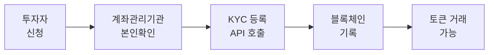
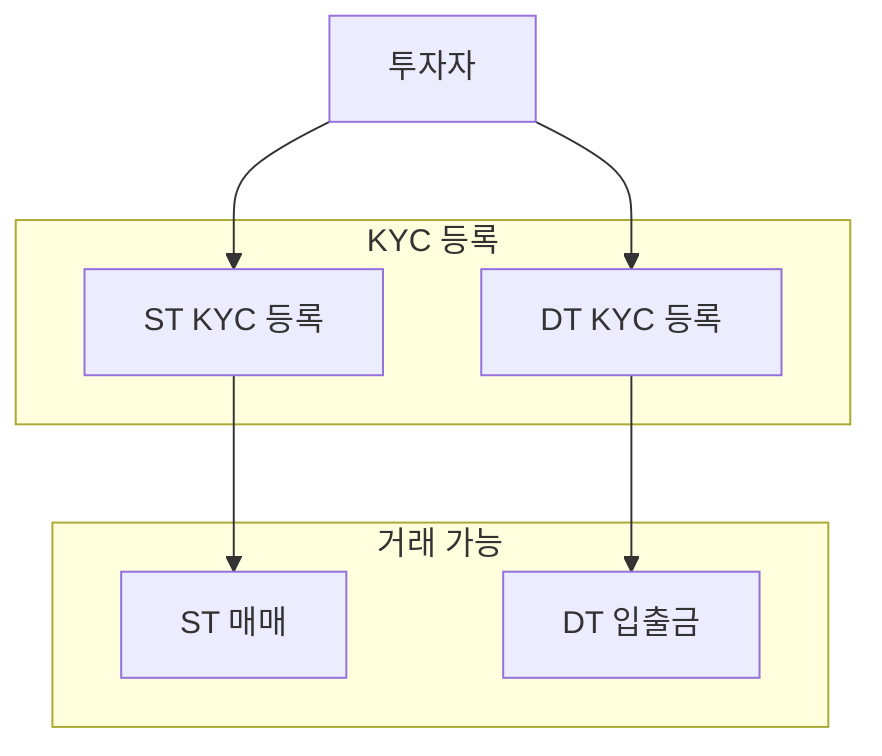

# KYC 개요

KYC(Know Your Customer)는 Pulse 네트워크에서 토큰 거래의 핵심 요소입니다. 모든 토큰 전송은 KYC 등록된 지갑 주소 간에만 가능합니다.

---

## KYC가 필요한 이유

Pulse 네트워크는 **규제 준수**를 위해 설계되었습니다:

<CardGroup cols={2}>
  <Card title="금융실명제" icon="id-card">
    실명 확인된 투자자만 토큰 보유 가능
  </Card>
  <Card title="자금세탁방지" icon="shield">
    AML/CFT 규제 준수
  </Card>
  <Card title="투자자 보호" icon="user-shield">
    적격 투자자 확인
  </Card>
  <Card title="거래 추적" icon="magnifying-glass">
    모든 거래 내역 감사 가능
  </Card>
</CardGroup>

---

## KYC 플로우

### 단계별 설명

<Steps>
  <Step title="투자자 신청">
    투자자가 계좌관리기관(증권사)에 계좌 개설 신청
  </Step>
  <Step title="본인확인">
    계좌관리기관이 실명확인 절차 수행 (비대면/대면)
  </Step>
  <Step title="KYC 등록">
    본인확인 완료 후 KYC API를 통해 지갑 주소 등록
  </Step>
  <Step title="거래 가능">
    KYC 등록된 주소로 토큰 입출금 가능
  </Step>
</Steps>

---

## KYC 상태

지갑 주소는 다음 KYC 상태를 가질 수 있습니다:

| 상태 | 설명 | 토큰 전송 |
|------|------|----------|
| **등록됨** | KYC 등록 완료 | 가능 |
| **미등록** | KYC 미등록 | 불가 |
| **해제됨** | KYC 등록 해제 | 불가 |

<Note>
  KYC 상태는 토큰별로 관리됩니다. ST 토큰과 DT 토큰에 각각 KYC 등록이 필요합니다.
</Note>

---

## 토큰별 KYC

### Security Token (ST)

- 증권사가 KYC 등록 수행
- 투자자 적격성 확인 필요
- 투자계약증권의 경우 자격 요건 확인

### Digital Token (DT)

- 결제용 토큰
- ST 보유자는 자동으로 DT KYC 등록
- 원화 입출금을 위해 필요

---

## KYC 등록 주체

| 역할 | 담당자 | 권한 |
|------|--------|------|
| **KYC 등록** | 계좌관리기관 (증권사) | KYC 등록/해제 |
| **KYC 확인** | 발행사/유통사 | KYC 상태 조회 |

<Warning>
  KYC 등록은 계좌관리기관만 수행할 수 있습니다. 발행사나 유통사는 등록 권한이 없습니다.
</Warning>

---

## KYC 해제

다음 경우에 KYC 등록이 해제될 수 있습니다:

- **계좌 해지**: 투자자 요청에 의한 계좌 해지
- **규제 조치**: 금융당국의 요청
- **AML 조치**: 자금세탁방지 규정 위반

KYC가 해제되면:
1. 해당 주소로의 토큰 전송 불가
2. 해당 주소에서의 토큰 전송 불가
3. 기존 보유 토큰은 유지 (단, 거래 불가)

---

## 관련 문서

<CardGroup cols={2}>
  <Card title="KYC API" icon="code" href="/account/kyc-api">
    KYC 등록/해제 API 사용법
  </Card>
  <Card title="Token Holder API" icon="wallet" href="/account/token-holder-api">
    토큰 보유자 정보 조회
  </Card>
  <Card title="지갑 주소" icon="wallet" href="/account/wallet-address">
    지갑 주소 관리
  </Card>
  <Card title="규제 요건" icon="gavel" href="/appendix/regulatory">
    금융위 규제 요건
  </Card>
</CardGroup>
