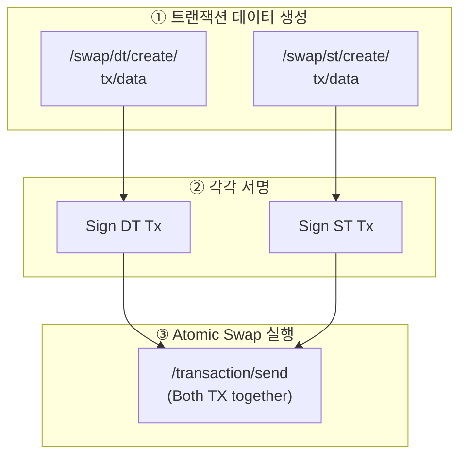

# Swap API

Swap API는 Security Token(ST)과 Digital Token(DT) 간의 스왑을 위한 트랜잭션 데이터를 생성합니다.

<Info>
  DvP(Delivery versus Payment)는 증권 인도와 대금 지급이 동시에 이루어지는 결제 방식으로, 결제 리스크를 최소화합니다.
</Info>

---

## DT 스왑 트랜잭션 데이터 생성

DT(Digital Token) 전송을 위한 스왑 트랜잭션 데이터를 생성합니다.

### Request

```bash
POST /main/v1/swap/dt/create/tx/data
```

### Body Parameters

<ParamField body="tokenSymbol" type="string" required>
  DT 토큰 심볼 (`DT`)
</ParamField>

<ParamField body="partition" type="string" required>
  파티션 ID
</ParamField>

<ParamField body="from" type="string" required>
  DT 송신자 주소 (매수자)
</ParamField>

<ParamField body="to" type="string" required>
  DT 수신자 주소 (매도자)
</ParamField>

<ParamField body="amount" type="number" required>
  DT 전송 수량 (결제 금액)
</ParamField>

<ParamField body="data" type="string">
  추가 데이터
</ParamField>

### Example

<CodeGroup>

```bash cURL
curl -X POST "https://api.stopulse.co.kr/main/v1/swap/dt/create/tx/data" \
  -H "Authorization: Bearer {access_token}" \
  -H "Content-Type: application/json" \
  -d '{
    "tokenSymbol": "DT",
    "partition": "0x0000...0001",
    "from": "0xBuyer...",
    "to": "0xSeller...",
    "amount": 1000000,
    "data": ""
  }'
```

```javascript JavaScript
const response = await fetch(
  'https://api.stopulse.co.kr/main/v1/swap/dt/create/tx/data',
  {
    method: 'POST',
    headers: {
      'Authorization': 'Bearer {access_token}',
      'Content-Type': 'application/json'
    },
    body: JSON.stringify({
      tokenSymbol: 'DT',
      partition: '0x0000...0001',
      from: '0xBuyer...',   // 매수자: DT 지급
      to: '0xSeller...',     // 매도자: DT 수령
      amount: 1000000,       // 결제 금액
      data: ''
    })
  }
);
```

</CodeGroup>

### Response

```json 200
{
  "to": "0xContractAddress...",
  "data": "0xEncodedTransactionData...",
  "gas": "150000"
}
```

---

## ST 스왑 트랜잭션 데이터 생성

ST(Security Token) 전송을 위한 스왑 트랜잭션 데이터를 생성합니다.

### Request

```bash
POST /main/v1/swap/st/create/tx/data
```

### Body Parameters

<ParamField body="tokenSymbol" type="string" required>
  ST 토큰 심볼
</ParamField>

<ParamField body="partition" type="string" required>
  파티션 ID
</ParamField>

<ParamField body="from" type="string" required>
  ST 송신자 주소 (매도자)
</ParamField>

<ParamField body="to" type="string" required>
  ST 수신자 주소 (매수자)
</ParamField>

<ParamField body="amount" type="number" required>
  ST 전송 수량
</ParamField>

<ParamField body="data" type="string">
  추가 데이터
</ParamField>

### Example

```bash cURL
curl -X POST "https://api.stopulse.co.kr/main/v1/swap/st/create/tx/data" \
  -H "Authorization: Bearer {access_token}" \
  -H "Content-Type: application/json" \
  -d '{
    "tokenSymbol": "PULSE-ST-001",
    "partition": "0x0000...0001",
    "from": "0xSeller...",
    "to": "0xBuyer...",
    "amount": 100,
    "data": ""
  }'
```

### Response

```json 200
{
  "to": "0xContractAddress...",
  "data": "0xEncodedTransactionData...",
  "gas": "150000"
}
```

---

## DvP 스왑 플로우



**결과**: ST와 DT가 원자적으로 교환 (동시 성공 또는 동시 실패)

---

## 스왑 예시 코드

```javascript
async function executeDvPSwap(seller, buyer, stAmount, dtAmount) {
  // 1. DT 트랜잭션 데이터 생성 (매수자 → 매도자)
  const dtTxData = await fetch(
    'https://api.stopulse.co.kr/main/v1/swap/dt/create/tx/data',
    {
      method: 'POST',
      headers: {
        'Authorization': `Bearer ${accessToken}`,
        'Content-Type': 'application/json'
      },
      body: JSON.stringify({
        tokenSymbol: 'DT',
        partition: defaultPartition,
        from: buyer,
        to: seller,
        amount: dtAmount,
        data: ''
      })
    }
  ).then(r => r.json());

  // 2. ST 트랜잭션 데이터 생성 (매도자 → 매수자)
  const stTxData = await fetch(
    'https://api.stopulse.co.kr/main/v1/swap/st/create/tx/data',
    {
      method: 'POST',
      headers: {
        'Authorization': `Bearer ${accessToken}`,
        'Content-Type': 'application/json'
      },
      body: JSON.stringify({
        tokenSymbol: 'PULSE-ST-001',
        partition: defaultPartition,
        from: seller,
        to: buyer,
        amount: stAmount,
        data: ''
      })
    }
  ).then(r => r.json());

  // 3. 각 트랜잭션 서명
  const signedDtTx = await signTransaction(dtTxData);
  const signedStTx = await signTransaction(stTxData);

  // 4. Atomic Swap 실행
  const result = await fetch(
    'https://api.stopulse.co.kr/main/v1/transaction/send',
    {
      method: 'POST',
      headers: {
        'Authorization': `Bearer ${accessToken}`,
        'Content-Type': 'application/json'
      },
      body: JSON.stringify({
        transactions: [signedDtTx, signedStTx]
      })
    }
  ).then(r => r.json());

  return result;
}
```

---

## 에러 응답

| HTTP Status | 에러 코드 | 설명 |
|-------------|----------|------|
| 400 | `INSUFFICIENT_BALANCE` | 잔액 부족 |
| 400 | `KYC_NOT_REGISTERED` | KYC 미등록 주소 포함 |
| 400 | `INVALID_TOKEN` | 유효하지 않은 토큰 |
| 403 | `NOT_OPERATOR` | Operator 권한 없음 |

<Warning>
  스왑 실행 중 오류 발생 시 모든 전송이 자동으로 롤백됩니다. 부분 실행은 발생하지 않습니다.
</Warning>
