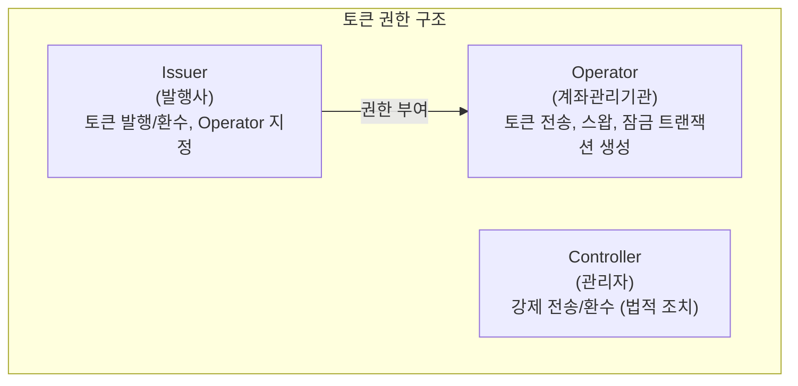

# Operator API

Operator API는 토큰의 Operator 키 목록을 조회하고 특정 계정의 Operator 권한을 확인합니다.

## Operator란?

Operator는 토큰 전송, 스왑, 잠금 등의 작업을 수행할 수 있는 권한을 가진 계정입니다. 일반적으로 증권사(계좌관리기관)가 Operator 역할을 수행합니다.

<Info>
  Operator는 토큰 소유자를 대신하여 토큰 작업을 수행할 수 있으며, 이를 통해 증권 거래의 자동화가 가능합니다.
</Info>

---

## Operator 목록 조회

특정 토큰의 등록된 Operator 목록을 조회합니다.

### Request

```bash
GET /main/v1/operator/{tokenSymbol}/list
```

<ParamField path="tokenSymbol" type="string" required>
  토큰 심볼 (예: `PULSE-ST-001`)
</ParamField>

### Example

<CodeGroup>

```bash cURL
curl -X GET "https://api.stopulse.co.kr/main/v1/operator/PULSE-ST-001/list" \
  -H "Authorization: Bearer {access_token}"
```

```javascript JavaScript
const response = await fetch(
  'https://api.stopulse.co.kr/main/v1/operator/PULSE-ST-001/list',
  {
    headers: { 'Authorization': 'Bearer {access_token}' }
  }
);
const operators = await response.json();
console.log('Operator 목록:', operators);
```

```python Python
import requests

url = "https://api.stopulse.co.kr/main/v1/operator/PULSE-ST-001/list"
headers = {"Authorization": "Bearer {access_token}"}

response = requests.get(url, headers=headers)
print("Operator 목록:", response.json())
```

</CodeGroup>

### Response

```json 200
{
  "operators": [
    "0xAdb6Dc93FF5d5d93998e1643A03048C5437B08B7",
    "0xFE3B557E8Fb62b89F4916B721be55cEb828dBd73"
  ]
}
```

---

## Operator 권한 확인

특정 계정이 토큰의 Operator 권한을 가지고 있는지 확인합니다.

### Request

```bash
GET /main/v1/operator/{tokenSymbol}/{account}/check
```

<ParamField path="tokenSymbol" type="string" required>
  토큰 심볼
</ParamField>

<ParamField path="account" type="string" required>
  확인할 계정 주소
</ParamField>

### Example

<CodeGroup>

```bash cURL
curl -X GET "https://api.stopulse.co.kr/main/v1/operator/PULSE-ST-001/0xAdb6Dc93FF5d5d93998e1643A03048C5437B08B7/check" \
  -H "Authorization: Bearer {access_token}"
```

```javascript JavaScript
const tokenSymbol = 'PULSE-ST-001';
const account = '0xAdb6Dc93FF5d5d93998e1643A03048C5437B08B7';

const response = await fetch(
  `https://api.stopulse.co.kr/main/v1/operator/${tokenSymbol}/${account}/check`,
  {
    headers: { 'Authorization': 'Bearer {access_token}' }
  }
);

const isOperator = await response.json();
console.log('Operator 여부:', isOperator); // true or false
```

```python Python
import requests

token_symbol = "PULSE-ST-001"
account = "0xAdb6Dc93FF5d5d93998e1643A03048C5437B08B7"

url = f"https://api.stopulse.co.kr/main/v1/operator/{token_symbol}/{account}/check"
headers = {"Authorization": "Bearer {access_token}"}

response = requests.get(url, headers=headers)
print("Operator 여부:", response.json())
```

</CodeGroup>

### Response

```json 200
true
```

또는

```json 200
false
```

---

## Operator 권한 구조



---

## Operator가 수행 가능한 작업

| API | 설명 |
|-----|------|
| `POST /transfer/tx/data` | 토큰 전송 트랜잭션 데이터 생성 |
| `POST /transfer/between-partitions/tx/data` | 파티션 간 전송 데이터 생성 |
| `POST /swap/dt/create/tx/data` | DT 스왑 트랜잭션 데이터 생성 |
| `POST /swap/st/create/tx/data` | ST 스왑 트랜잭션 데이터 생성 |
| `POST /tokens/lock/create/tx/data` | 토큰 잠금 트랜잭션 데이터 생성 |
| `POST /tokens/lock/remove/tx/data` | 토큰 잠금 해제 트랜잭션 데이터 생성 |
| `POST /redeem/tx/data` | 토큰 환수 트랜잭션 데이터 생성 |

---

## 에러 응답

| HTTP Status | 에러 코드 | 설명 |
|-------------|----------|------|
| 400 | `INVALID_ADDRESS` | 유효하지 않은 지갑 주소 |
| 404 | `TOKEN_NOT_FOUND` | 토큰이 존재하지 않음 |
