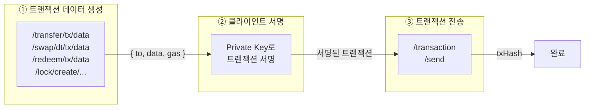

# Transaction API

Transaction API는 서명된 트랜잭션을 블록체인에 전송합니다.

<Note>
  Pulse 네트워크는 QBFT 합의를 사용하므로, 블록 확정 후 되돌림(reorg)이 발생하지 않습니다.
</Note>

---

## 트랜잭션 전송

서명된 트랜잭션을 블록체인에 전송합니다.

### Request

```bash
POST /main/v1/transaction/send
```

### Body Parameters

<ParamField body="signedTx" type="string" required>
  서명된 트랜잭션 데이터 (RLP 인코딩된 hex 문자열)
</ParamField>

### Example

<CodeGroup>

```bash cURL
curl -X POST "https://api.stopulse.co.kr/main/v1/transaction/send" \
  -H "Authorization: Bearer {access_token}" \
  -H "Content-Type: application/json" \
  -d '{
    "signedTx": "0xf86c808504a817c80082520894..."
  }'
```

```javascript JavaScript
const response = await fetch(
  'https://api.stopulse.co.kr/main/v1/transaction/send',
  {
    method: 'POST',
    headers: {
      'Authorization': 'Bearer {access_token}',
      'Content-Type': 'application/json'
    },
    body: JSON.stringify({
      signedTx: '0xf86c808504a817c80082520894...'
    })
  }
);

const result = await response.json();
console.log('트랜잭션 해시:', result.transactionHash);
```

```python Python
import requests

url = "https://api.stopulse.co.kr/main/v1/transaction/send"
headers = {
    "Authorization": "Bearer {access_token}",
    "Content-Type": "application/json"
}
data = {
    "signedTx": "0xf86c808504a817c80082520894..."
}

response = requests.post(url, headers=headers, json=data)
print("결과:", response.json())
```

</CodeGroup>

### Response

```json 200
{
  "transactionHash": "0xabc123def456789...",
  "requestId": "TX:da9c32e8-9d89-45b0-aee2-8b56e1c65189"
}
```

<ResponseField name="transactionHash" type="string">
  블록체인 트랜잭션 해시
</ResponseField>

<ResponseField name="requestId" type="string">
  요청 ID (형식: `TX:{uuid}`)
</ResponseField>

---

## 트랜잭션 플로우

모든 토큰 작업(전송, 스왑, 잠금 등)은 동일한 패턴을 따릅니다:



---

## 트랜잭션 서명 예시

```javascript
const { ethers } = require('ethers');

// 1. 트랜잭션 데이터 생성 (API 호출)
const txData = await fetch(
  'https://api.stopulse.co.kr/main/v1/transfer/tx/data',
  {
    method: 'POST',
    headers: {
      'Authorization': `Bearer ${accessToken}`,
      'Content-Type': 'application/json'
    },
    body: JSON.stringify({
      tokenSymbol: 'PULSE-ST-001',
      partition: '0x0000...0001',
      from: senderAddress,
      to: receiverAddress,
      amount: 100,
      data: ''
    })
  }
).then(r => r.json());

// 2. 트랜잭션 객체 생성
const tx = {
  to: txData.to,
  data: txData.data,
  gasLimit: txData.gas,
  gasPrice: ethers.parseUnits('0', 'gwei'), // Pulse 네트워크는 가스비 0
  nonce: await provider.getTransactionCount(senderAddress),
  chainId: 1337 // Pulse 네트워크 체인 ID
};

// 3. 서명
const wallet = new ethers.Wallet(privateKey);
const signedTx = await wallet.signTransaction(tx);

// 4. 트랜잭션 전송
const result = await fetch(
  'https://api.stopulse.co.kr/main/v1/transaction/send',
  {
    method: 'POST',
    headers: {
      'Authorization': `Bearer ${accessToken}`,
      'Content-Type': 'application/json'
    },
    body: JSON.stringify({
      signedTx: signedTx
    })
  }
).then(r => r.json());

console.log('트랜잭션 해시:', result.transactionHash);
```

---

## Atomic Swap (DvP) 전송

ST와 DT를 원자적으로 교환하는 경우, 두 트랜잭션을 함께 전송합니다.

```javascript
async function executeDvPSwap(seller, buyer, stAmount, dtAmount) {
  // 1. DT 트랜잭션 데이터 생성
  const dtTxData = await createDtTxData(buyer, seller, dtAmount);

  // 2. ST 트랜잭션 데이터 생성
  const stTxData = await createStTxData(seller, buyer, stAmount);

  // 3. 각각 서명
  const signedDtTx = await signTransaction(dtTxData, buyerWallet);
  const signedStTx = await signTransaction(stTxData, sellerWallet);

  // 4. Atomic Swap 실행 - 두 트랜잭션 함께 전송
  const result = await fetch(
    'https://api.stopulse.co.kr/main/v1/transaction/send',
    {
      method: 'POST',
      headers: {
        'Authorization': `Bearer ${accessToken}`,
        'Content-Type': 'application/json'
      },
      body: JSON.stringify({
        transactions: [signedDtTx, signedStTx]
      })
    }
  ).then(r => r.json());

  return result;
}
```

<Warning>
  Atomic Swap에서 두 트랜잭션 중 하나라도 실패하면 모두 롤백됩니다.
</Warning>

---

## 트랜잭션 상태

| 상태 | 설명 |
|------|------|
| `pending` | 트랜잭션이 블록에 포함되기 전 |
| `confirmed` | 블록에 포함되어 확정됨 |
| `failed` | 트랜잭션 실행 실패 |

---

## Block Explorer 연동

트랜잭션 상세 정보는 Block Explorer(Blockscout)에서도 확인 가능합니다.

```javascript
// Block Explorer URL 생성
const explorerUrl = `https://explorer.stopulse.co.kr/tx/${transactionHash}`;
```

<Info>
  Block Explorer는 웹 브라우저에서 직접 트랜잭션, 블록, 주소를 조회할 수 있는 도구입니다.
</Info>

---

## 에러 응답

| HTTP Status | 에러 코드 | 설명 |
|-------------|----------|------|
| 400 | `INVALID_SIGNATURE` | 유효하지 않은 서명 |
| 400 | `INVALID_NONCE` | 잘못된 nonce 값 |
| 400 | `INSUFFICIENT_GAS` | 가스 부족 |
| 400 | `TRANSACTION_FAILED` | 트랜잭션 실행 실패 |
| 403 | `NOT_AUTHORIZED` | 트랜잭션 실행 권한 없음 |
