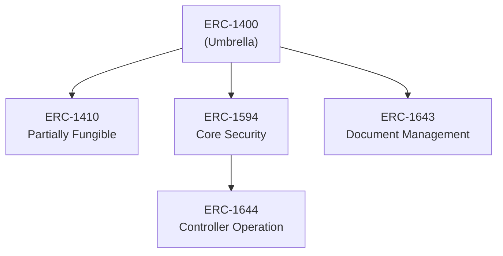
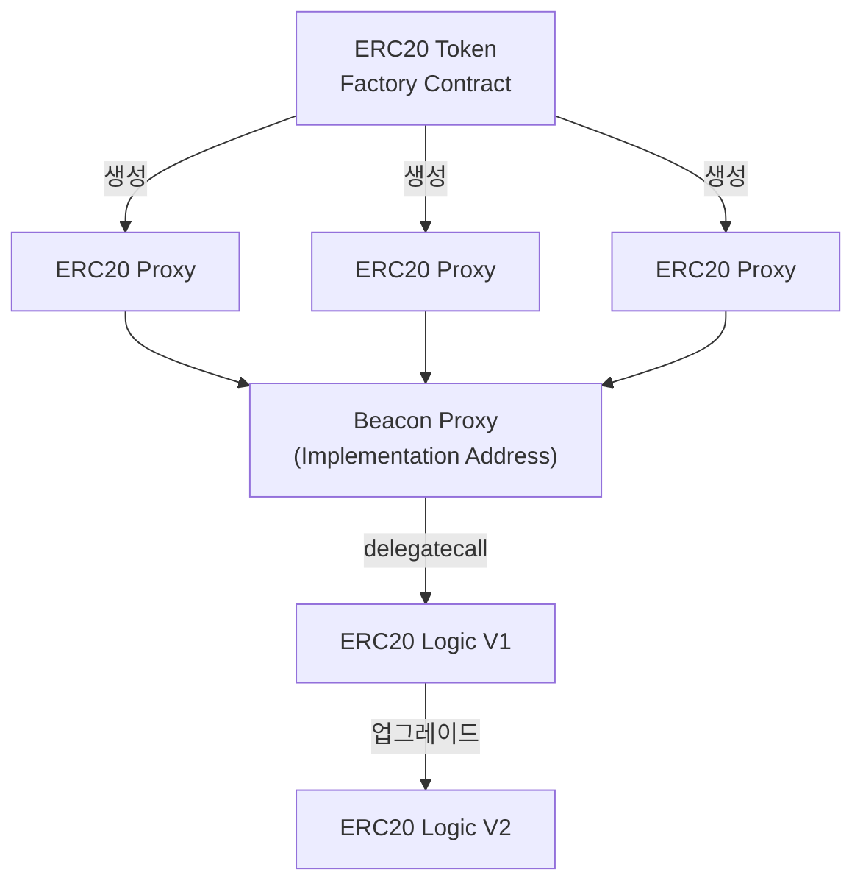

# 스마트 컨트랙트

Pulse는 **ERC-1400** 표준을 기반으로 한 토큰증권 스마트 컨트랙트를 사용합니다. 이 표준은 실물자산 기반 증권형 토큰의 발행, 유통, 권리 관리를 위한 가장 포괄적인 표준입니다.

## ERC-1400 개요

ERC-1400은 여러 ERC 표준을 통합한 **Umbrella Architecture** 형태로 구현됩니다:



## 하위 표준 상세

<AccordionGroup>
  <Accordion title="ERC-1410: Partially Fungible Tokens">
    **부분적으로 대체 가능한 토큰(PFTs)에 대한 표준**

    토큰을 다양한 파티션 또는 하위 집합으로 분류할 수 있게 합니다:
    - 각 파티션별 규제 준수 요구사항 적용
    - 서로 다른 사용 조건 설정
    - 전환사채, 우선주 등 복잡한 증권 구조 지원

    ```solidity
    // 파티션별 잔액 조회
    function balanceOfByPartition(bytes32 partition, address holder)
        external view returns (uint256);

    // 파티션 간 전송
    function transferByPartition(
        bytes32 partition,
        address to,
        uint256 value,
        bytes calldata data
    ) external returns (bytes32);
    ```
  </Accordion>

  <Accordion title="ERC-1594: Core Security Token Standard">
    **토큰증권 핵심 표준**

    토큰증권의 전송 및 발행, 규제 준수 검사, 문서화 기능:
    - 토큰 발행 (Issue)
    - 토큰 환수 (Redeem)
    - 전송 가능 여부 검증
    - 발행 가능 여부 검증

    ```solidity
    // 토큰 발행 가능 여부 확인
    function isIssuable() external view returns (bool);

    // 전송 가능 여부 확인
    function canTransfer(address to, uint256 value)
        external view returns (bool, bytes32, bytes32);
    ```
  </Accordion>

  <Accordion title="ERC-1643: Document Management Standard">
    **스마트 컨트랙트 문서 관리 표준**

    토큰과 관련된 문서를 투명하게 관리:
    - 규제 준수 문서
    - 투자자 정보
    - 증권신고서
    - 투자설명서

    ```solidity
    // 문서 설정
    function setDocument(bytes32 name, string calldata uri, bytes32 documentHash)
        external;

    // 문서 조회
    function getDocument(bytes32 name)
        external view returns (string memory, bytes32, uint256);
    ```
  </Accordion>

  <Accordion title="ERC-1644: Controller Token Operation Standard">
    **토큰 컨트롤러 연산 표준**

    규제 준수 또는 행정적 이유로 특정 토큰의 강제 이동이 필요할 때 사용:
    - 강제 전송 (법적 조치)
    - 토큰 동결
    - 토큰 압류

    ```solidity
    // 컨트롤러 강제 전송
    function controllerTransfer(
        address from,
        address to,
        uint256 value,
        bytes calldata data,
        bytes calldata operatorData
    ) external;
    ```
  </Accordion>
</AccordionGroup>

## Upgradable Smart Contract

블록체인에 배포된 스마트 컨트랙트는 일반적으로 수정이 불가능합니다. 하지만 Pulse는 **Proxy Pattern**을 적용하여 업그레이드 가능한 컨트랙트를 구현합니다.

### Beacon Proxy 패턴



### 컨트랙트 역할

| 컨트랙트 | 역할 |
|---------|------|
| **Proxy Contract** | 사용자 요청을 Logic Contract로 전달 (delegatecall) |
| **Beacon Contract** | Logic Contract 주소를 저장 (이정표 역할) |
| **Logic Contract** | 실제 비즈니스 로직 구현 |

### 업그레이드 장점

<CardGroup cols={2}>
  <Card title="규제 대응" icon="scale-balanced">
    변화하는 금융 규제에 유연하게 대응
  </Card>
  <Card title="버그 수정" icon="bug">
    발견된 버그를 신속하게 패치
  </Card>
  <Card title="기능 추가" icon="plus">
    새로운 기능을 기존 토큰에 추가
  </Card>
  <Card title="데이터 보존" icon="database">
    업그레이드 시에도 기존 데이터 유지
  </Card>
</CardGroup>

## 분산원장에 포함되는 데이터

금융위원회 가이드라인에 따라 다음 데이터가 분산원장에 기록됩니다:

| 데이터 | 설명 |
|--------|------|
| 발행인 | 토큰 발행 주체 |
| 계좌관리기관 | 권리 관리 금융기관 |
| 증권 종류 | 투자계약증권, 수익증권 등 |
| 종목 식별 정보 | 토큰 심볼, 이름 |
| 보유 수량 | 각 투자자의 보유량 |
| 발행 수량 | 총 발행량 |
| 질권 설정 | 담보 설정된 수량 |
| 신탁재산 여부 | 신탁 관리 여부 |

## 컨트랙트 배포 및 관리

### Issuer Key (발행자)

토큰 발행 권한을 가진 키:

- 토큰 발행 (Issue)
- 토큰 소각 (Burn)
- 전송 제한 설정
- 컨트롤러 지정
- 운영자 지정

### 보안 관리

<Warning>
  Issuer Key는 AWS KMS 또는 Hardware Security Module(HSM)에서 안전하게 관리됩니다.
</Warning>

컨트랙트 배포 및 업그레이드 작업은 다중 서명(Multi-sig) 절차를 통해 진행됩니다.
