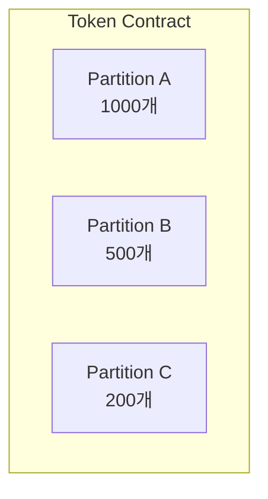
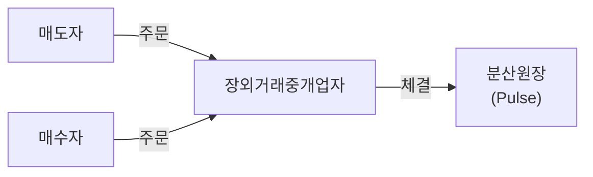

# 토큰 종류

Pulse 네트워크에서 발행되는 토큰은 크게 **ST(Security Token)**와 **DT(Delivery Token)**로 구분됩니다.

## ST (Security Token)

**Security Token**은 실물자산이나 권리를 기초로 발행되는 증권형 토큰입니다.

### 지원 증권 유형

<CardGroup cols={3}>
  <Card title="투자계약증권" icon="handshake">
    수익분배형 토큰
  </Card>
  <Card title="수익증권" icon="building">
    부동산, 선박, 콘텐츠 등
  </Card>
  <Card title="채무증권" icon="file-invoice">
    회사채, ABS 등
  </Card>
</CardGroup>

### ST 특징

| 특징 | 설명 |
|------|------|
| **기초자산 연동** | 실물자산의 가치를 반영 |
| **권리 표시** | 배당, 의결권 등 권리 포함 |
| **규제 준수** | 금융위 가이드라인 충족 |
| **KYC 필수** | 투자자 본인확인 필요 |

### 제외 대상

금융위 가이드라인에 따라 다음 증권은 토큰증권으로 발행할 수 없습니다:
- 상장증권
- 상장 DR (Depositary Receipt)
- 파생결합증권

## DT (Delivery Token)

**Delivery Token**은 ST와의 교환(Swap)에 사용되는 결제용 토큰입니다.

### DT 역할


### DvP (Delivery versus Payment)

ST와 DT의 Swap을 통해 **T+0 당일 결제**가 가능합니다:

1. 매수자가 DT를 보유
2. 매도자가 ST를 보유
3. Swap 함수 호출
4. 원자적(Atomic) 교환 완료

<Info>
  Swap은 원자적으로 실행되어 한쪽만 전송되는 상황이 발생하지 않습니다.
</Info>

## 파티션 (Partition)

ERC-1410 표준에 따라 토큰을 **파티션**으로 구분하여 관리할 수 있습니다.

### 파티션 개념



### 파티션 사용 사례

<AccordionGroup>
  <Accordion title="배당 시점별 구분">
    동일 토큰이라도 발행 시점에 따라 배당 권리가 다를 수 있습니다:
    - Partition A: 2024년 1분기 발행 (배당 적용)
    - Partition B: 2024년 3분기 발행 (배당 미적용)
  </Accordion>

  <Accordion title="권리 종류별 구분">
    권리 유형에 따라 파티션을 분리합니다:
    - Partition A: 의결권 있음
    - Partition B: 의결권 없음 (우선주)
  </Accordion>

  <Accordion title="이체 제한별 구분">
    이체 제한 조건에 따라 구분합니다:
    - Partition A: 자유 이체
    - Partition B: Lock-up 기간 적용
  </Accordion>
</AccordionGroup>

### 파티션 API

```javascript
// 투자자의 파티션별 잔액 조회
GET /main/v1/holders/{holder}/tokens/{token}/partitions

// 응답 예시
{
  "holder": "0xd14f723e859ec4f3...",
  "token": "PULSE-ST-001",
  "partitions": [
    {
      "partition": "0x41...", // Partition A
      "balance": "1000"
    },
    {
      "partition": "0x42...", // Partition B
      "balance": "500"
    }
  ]
}
```

## 토큰 생명주기

### 발행 (Issue)


### 유통 (Transfer)



### 환수 (Redeem)


## 토큰 잠금 (Lock)

특정 조건에서 토큰 이체를 제한할 수 있습니다:

### 잠금 사유

| 사유 | 설명 |
|------|------|
| **질권 설정** | 담보로 제공된 토큰 |
| **Lock-up** | 일정 기간 매도 금지 |
| **법적 조치** | 압류, 동결 |
| **청산 대기** | 거래 체결 후 결제 대기 |

### 잠금 API

```javascript
// 토큰 잠금
POST /main/v1/tokens/{token}/lock

// 잠금 해제
POST /main/v1/tokens/{token}/unlock
```

<Warning>
  잠긴 토큰은 전송이 불가능합니다. 잠금 해제 후에만 이체할 수 있습니다.
</Warning>
