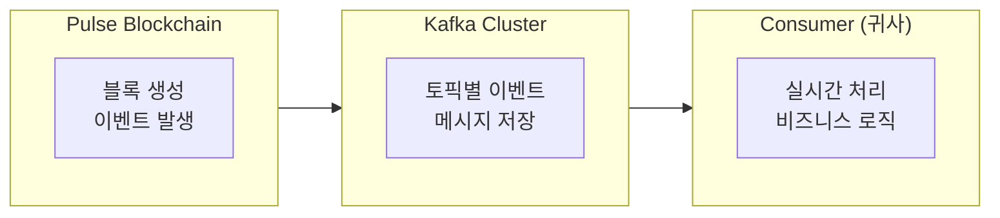

# Kafka 연동 가이드

이 가이드에서는 Pulse 네트워크의 실시간 이벤트를 Kafka를 통해 수신하고 처리하는 방법을 설명합니다.

## 개요

Pulse 네트워크는 블록체인 이벤트를 Kafka로 발행하여 외부 시스템과 실시간 연동을 지원합니다.



---

## Kafka 토픽 구조

### 토픽 목록

| 토픽 | 설명 | 메시지 유형 |
|-----|------|-----------|
| `pulse.blocks` | 새 블록 생성 이벤트 | BlockCreated |
| `pulse.transactions` | 트랜잭션 이벤트 | TransactionEvent |
| `pulse.transfers` | 토큰 전송 이벤트 | TransferEvent |
| `pulse.swaps` | DvP 스왑 이벤트 | SwapEvent |
| `pulse.kyc` | KYC 상태 변경 이벤트 | KYCEvent |

---

## 연동 설정

### 1. Kafka Consumer 설정

```javascript
const { Kafka } = require('kafkajs');

const kafka = new Kafka({
  clientId: 'your-service-name',
  brokers: ['kafka.stopulse.co.kr:9092'],
  ssl: true,
  sasl: {
    mechanism: 'plain',
    username: process.env.KAFKA_USERNAME,
    password: process.env.KAFKA_PASSWORD
  }
});

const consumer = kafka.consumer({
  groupId: 'your-consumer-group',
  sessionTimeout: 30000,
  heartbeatInterval: 3000
});
```

### 2. 토픽 구독

```javascript
async function startConsumer() {
  await consumer.connect();

  // 필요한 토픽 구독
  await consumer.subscribe({
    topics: ['pulse.transactions', 'pulse.transfers', 'pulse.swaps'],
    fromBeginning: false  // 최신 메시지부터 수신
  });

  await consumer.run({
    eachMessage: async ({ topic, partition, message }) => {
      const event = JSON.parse(message.value.toString());
      await handleEvent(topic, event);
    }
  });
}
```

---

## 이벤트 유형

### TransferEvent

토큰 전송 완료 시 발행:

```json
{
  "eventType": "TRANSFER_COMPLETED",
  "timestamp": "2024-01-15T10:30:00.000Z",
  "blockNumber": 12345678,
  "transactionHash": "0xabc123...",
  "data": {
    "token": "PULSE-ST-001",
    "from": "0xd14f723e859ec4f3edee57bf78ceb7c81de08dfb",
    "to": "0x734c49630caC28EaaC33e9722268e64cA80AbcFd",
    "value": "100",
    "partition": "0x0000...0001"
  }
}
```

### SwapEvent

DvP 스왑 완료 시 발행:

```json
{
  "eventType": "SWAP_COMPLETED",
  "timestamp": "2024-01-15T10:30:00.000Z",
  "blockNumber": 12345678,
  "transactionHash": "0xdef456...",
  "data": {
    "stToken": "PULSE-ST-001",
    "dtToken": "PULSE-DT",
    "stTransfer": {
      "from": "0xSeller...",
      "to": "0xBuyer...",
      "value": "100"
    },
    "dtTransfer": {
      "from": "0xBuyer...",
      "to": "0xSeller...",
      "value": "1000000"
    }
  }
}
```

### KYCEvent

KYC 상태 변경 시 발행:

```json
{
  "eventType": "KYC_REGISTERED",
  "timestamp": "2024-01-15T10:30:00.000Z",
  "transactionHash": "0xghi789...",
  "data": {
    "token": "PULSE-ST-001",
    "holder": "0xd14f723e859ec4f3edee57bf78ceb7c81de08dfb",
    "registered": true
  }
}
```

### BlockCreated

새 블록 생성 시 발행:

```json
{
  "eventType": "BLOCK_CREATED",
  "timestamp": "2024-01-15T10:30:00.000Z",
  "data": {
    "blockNumber": 12345678,
    "blockHash": "0xblock...",
    "parentHash": "0xparent...",
    "transactionCount": 5,
    "validator": "0xvalidator..."
  }
}
```

---

## 이벤트 처리 구현

### 이벤트 핸들러

```javascript
async function handleEvent(topic, event) {
  console.log(`[${topic}] ${event.eventType} received`);

  switch (event.eventType) {
    case 'TRANSFER_COMPLETED':
      await handleTransferCompleted(event);
      break;

    case 'SWAP_COMPLETED':
      await handleSwapCompleted(event);
      break;

    case 'KYC_REGISTERED':
      await handleKYCRegistered(event);
      break;

    case 'KYC_REMOVED':
      await handleKYCRemoved(event);
      break;

    case 'TRANSACTION_FAILED':
      await handleTransactionFailed(event);
      break;

    default:
      console.log('Unknown event type:', event.eventType);
  }
}
```

### 전송 완료 처리

```javascript
async function handleTransferCompleted(event) {
  const { token, from, to, value } = event.data;

  // 1. 내부 잔액 캐시 업데이트
  await updateBalanceCache(token, from, `-${value}`);
  await updateBalanceCache(token, to, value);

  // 2. 관련 주문 상태 업데이트
  const relatedOrders = await findOrdersByTransaction(event.transactionHash);
  for (const order of relatedOrders) {
    await updateOrderStatus(order.id, 'completed');
  }

  // 3. 고객 알림
  await notifyCustomer(from, {
    type: 'TRANSFER_SENT',
    token,
    value,
    to
  });

  await notifyCustomer(to, {
    type: 'TRANSFER_RECEIVED',
    token,
    value,
    from
  });

  // 4. 감사 로그 저장
  await saveAuditLog({
    eventType: 'TRANSFER',
    transactionHash: event.transactionHash,
    details: event.data
  });
}
```

### 스왑 완료 처리

```javascript
async function handleSwapCompleted(event) {
  const { stToken, dtToken, stTransfer, dtTransfer } = event.data;

  // 1. 거래 체결 내역 저장
  await saveTradeExecution({
    transactionHash: event.transactionHash,
    stToken,
    dtToken,
    seller: stTransfer.from,
    buyer: stTransfer.to,
    stAmount: stTransfer.value,
    dtAmount: dtTransfer.value,
    executedAt: event.timestamp
  });

  // 2. 주문 상태 업데이트
  await markOrdersAsSettled(event.transactionHash);

  // 3. 잔액 캐시 업데이트
  await updateBalanceCache(stToken, stTransfer.from, `-${stTransfer.value}`);
  await updateBalanceCache(stToken, stTransfer.to, stTransfer.value);
  await updateBalanceCache(dtToken, dtTransfer.from, `-${dtTransfer.value}`);
  await updateBalanceCache(dtToken, dtTransfer.to, dtTransfer.value);

  // 4. 정산 완료 알림
  await notifySettlementCompleted(event);
}
```

---

## 에러 처리

### 재시도 로직

```javascript
const consumer = kafka.consumer({
  groupId: 'your-consumer-group',
  retry: {
    initialRetryTime: 100,
    retries: 8,
    maxRetryTime: 30000,
    multiplier: 2
  }
});

await consumer.run({
  eachMessage: async ({ topic, partition, message }) => {
    try {
      const event = JSON.parse(message.value.toString());
      await handleEvent(topic, event);
    } catch (error) {
      // 처리 실패 시 Dead Letter Queue로 전송
      await sendToDeadLetterQueue(topic, message, error);
    }
  }
});
```

### Dead Letter Queue 처리

```javascript
async function sendToDeadLetterQueue(originalTopic, message, error) {
  const producer = kafka.producer();
  await producer.connect();

  await producer.send({
    topic: `${originalTopic}.dlq`,
    messages: [{
      key: message.key,
      value: JSON.stringify({
        originalMessage: message.value.toString(),
        error: error.message,
        failedAt: new Date().toISOString(),
        retryCount: parseInt(message.headers?.retryCount || '0') + 1
      })
    }]
  });

  await producer.disconnect();
}
```

---

## 모니터링

### Consumer Lag 모니터링

```javascript
const admin = kafka.admin();
await admin.connect();

async function checkConsumerLag() {
  const groupDescription = await admin.describeGroups(['your-consumer-group']);

  for (const group of groupDescription.groups) {
    const offsets = await admin.fetchOffsets({
      groupId: group.groupId,
      topics: ['pulse.transactions']
    });

    console.log('Consumer offsets:', offsets);
  }
}

// 주기적 모니터링
setInterval(checkConsumerLag, 60000);
```

### 메트릭 수집

```javascript
const { InstrumentationEvent } = require('kafkajs');

const consumer = kafka.consumer({ groupId: 'your-consumer-group' });

consumer.on(consumer.events.HEARTBEAT, ({ timestamp }) => {
  metrics.recordHeartbeat(timestamp);
});

consumer.on(consumer.events.FETCH, ({ numberOfBatches, duration }) => {
  metrics.recordFetch(numberOfBatches, duration);
});

consumer.on(consumer.events.COMMIT_OFFSETS, ({ groupId, topics }) => {
  metrics.recordCommit(groupId, topics);
});
```

---

## 연동 체크리스트

<AccordionGroup>
  <Accordion title="연동 전 준비">
    - [ ] Kafka 접속 정보 수령 (브로커 주소, 인증 정보)
    - [ ] 네트워크 방화벽 설정 확인
    - [ ] Consumer Group ID 결정
    - [ ] 구독할 토픽 목록 확정
  </Accordion>
  <Accordion title="구현 체크리스트">
    - [ ] Kafka Consumer 설정
    - [ ] 토픽 구독 설정
    - [ ] 이벤트 핸들러 구현
    - [ ] 에러 처리 및 재시도 로직
    - [ ] Dead Letter Queue 처리
  </Accordion>
  <Accordion title="운영 체크리스트">
    - [ ] Consumer Lag 모니터링
    - [ ] 알림 설정
    - [ ] 로그 수집
    - [ ] 장애 복구 절차 수립
  </Accordion>
</AccordionGroup>

---

## 연동 지원

Kafka 연동 관련 문의는 아래로 연락주세요:

<Card title="기술 지원" icon="headset" href="mailto:shs.block@shinhan.com">
  shs.block@shinhan.com
</Card>
