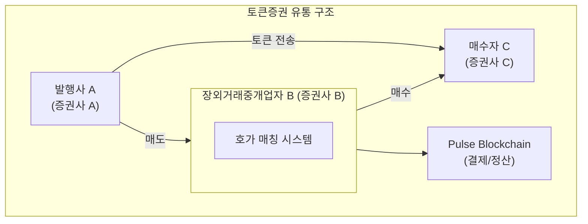
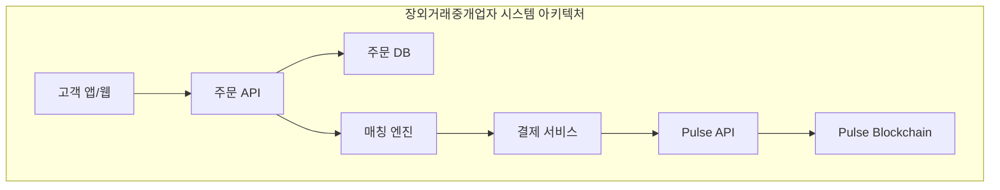

# 유통 시스템 연동 가이드

이 가이드에서는 장외거래중개업자(OTC Broker)가 Pulse 네트워크와 연동하여 토큰증권 유통 시스템을 구축하는 방법을 설명합니다.

## 유통 구조 개요

금융위 가이드라인에 따라 **발행과 유통은 분리**되어야 합니다:



<Note>
  장외거래중개업자는 자사 고객 간 거래만 중개할 수 있으며, 다자간 상대매매 방식(매수·매도 호가 일치 시 체결)을 사용합니다.
</Note>

---

## 시스템 구성 요소

### 장외거래중개업자 시스템

<CardGroup cols={2}>
  <Card title="주문 관리 시스템" icon="clipboard-list">
    - 매수/매도 주문 접수
    - 주문 유효성 검증
    - 주문 상태 관리
  </Card>
  <Card title="호가 매칭 엔진" icon="scale-balanced">
    - 매수/매도 호가 매칭
    - 가격 우선, 시간 우선 원칙
    - 체결 처리
  </Card>
  <Card title="결제 시스템" icon="money-check">
    - Pulse API 연동
    - DvP 결제 처리
    - 결제 실패 처리
  </Card>
  <Card title="고객 관리 시스템" icon="users">
    - 고객 계좌 관리
    - KYC 상태 관리
    - 잔액 조회
  </Card>
</CardGroup>

---

## 연동 아키텍처



---

## 구현 가이드

### 1. 주문 접수

```javascript
// 주문 데이터 구조
interface Order {
  orderId: string;
  type: 'buy' | 'sell';
  token: string;
  price: number;          // 주당 가격 (원)
  quantity: string;       // ST 수량
  investor: string;       // 지갑 주소
  status: 'pending' | 'matched' | 'settled' | 'cancelled';
  createdAt: Date;
}

// 주문 접수 API
app.post('/api/orders', async (req, res) => {
  const { type, token, price, quantity, investorId } = req.body;

  // 1. 투자자 정보 조회
  const investor = await getInvestorByAccountId(investorId);

  // 2. KYC 상태 확인
  const kycStatus = await pulseAPI.checkKYC(token, investor.walletAddress);
  if (!kycStatus.registered) {
    return res.status(400).json({ error: 'KYC 미등록' });
  }

  // 3. 매도 주문의 경우 잔액 확인
  if (type === 'sell') {
    const balance = await pulseAPI.getBalance(token, investor.walletAddress);
    if (BigInt(balance.balance) < BigInt(quantity)) {
      return res.status(400).json({ error: '잔액 부족' });
    }
  }

  // 4. 매수 주문의 경우 DT 잔액 확인
  if (type === 'buy') {
    const totalPrice = BigInt(price) * BigInt(quantity);
    const dtBalance = await pulseAPI.getBalance('PULSE-DT', investor.walletAddress);
    if (BigInt(dtBalance.balance) < totalPrice) {
      return res.status(400).json({ error: 'DT 잔액 부족' });
    }
  }

  // 5. 주문 저장
  const order = await saveOrder({
    type,
    token,
    price,
    quantity,
    investor: investor.walletAddress,
    status: 'pending'
  });

  // 6. 매칭 엔진에 전달
  matchingEngine.addOrder(order);

  res.json({ orderId: order.orderId });
});
```

### 2. 호가 매칭

```javascript
class MatchingEngine {
  private buyOrders: PriorityQueue<Order>;  // 가격 내림차순
  private sellOrders: PriorityQueue<Order>; // 가격 오름차순

  addOrder(order: Order) {
    if (order.type === 'buy') {
      this.buyOrders.push(order);
    } else {
      this.sellOrders.push(order);
    }

    this.tryMatch();
  }

  private async tryMatch() {
    while (
      this.buyOrders.length > 0 &&
      this.sellOrders.length > 0
    ) {
      const bestBuy = this.buyOrders.peek();
      const bestSell = this.sellOrders.peek();

      // 가격 일치 확인 (매수 호가 >= 매도 호가)
      if (bestBuy.price < bestSell.price) {
        break;
      }

      // 체결 수량 결정
      const matchedQuantity = this.min(
        BigInt(bestBuy.quantity),
        BigInt(bestSell.quantity)
      );

      // 체결 가격 (선 접수 주문 기준)
      const matchedPrice = bestBuy.createdAt < bestSell.createdAt
        ? bestBuy.price
        : bestSell.price;

      // 체결 처리
      await this.executeMatch({
        buyOrder: bestBuy,
        sellOrder: bestSell,
        quantity: matchedQuantity.toString(),
        price: matchedPrice
      });

      // 주문 업데이트
      this.updateOrderAfterMatch(bestBuy, matchedQuantity);
      this.updateOrderAfterMatch(bestSell, matchedQuantity);
    }
  }

  private async executeMatch(match) {
    // 결제 서비스로 전달
    await settlementService.settle(match);
  }
}
```

### 3. DvP 결제 처리

```javascript
class SettlementService {
  async settle(match) {
    const { buyOrder, sellOrder, quantity, price } = match;
    const totalDT = BigInt(price) * BigInt(quantity);

    // 1. Swap 가능 여부 확인
    const checkResult = await this.pulseAPI.checkSwap({
      stToken: match.token,
      dtToken: 'PULSE-DT',
      stFrom: sellOrder.investor,  // 매도자: ST 보유
      stTo: buyOrder.investor,     // 매수자: ST 수령
      stValue: quantity,
      dtFrom: buyOrder.investor,   // 매수자: DT 보유
      dtTo: sellOrder.investor,    // 매도자: DT 수령
      dtValue: totalDT.toString()
    });

    if (!checkResult.swappable) {
      // 결제 실패 처리
      await this.handleSettlementFailure(match, checkResult.reason);
      return;
    }

    // 2. Swap 실행 (Atomic DvP)
    try {
      const swapResult = await this.pulseAPI.executeSwap({
        stToken: match.token,
        dtToken: 'PULSE-DT',
        stFrom: sellOrder.investor,
        stTo: buyOrder.investor,
        stValue: quantity,
        dtFrom: buyOrder.investor,
        dtTo: sellOrder.investor,
        dtValue: totalDT.toString()
      });

      // 3. 결제 완료 처리
      await this.completeSettlement(match, swapResult);

    } catch (error) {
      // Swap 실패 시 자동 롤백됨
      await this.handleSettlementFailure(match, error.message);
    }
  }

  private async completeSettlement(match, swapResult) {
    // 주문 상태 업데이트
    await updateOrderStatus(match.buyOrder.orderId, 'settled');
    await updateOrderStatus(match.sellOrder.orderId, 'settled');

    // 체결 내역 저장
    await saveTradeHistory({
      token: match.token,
      buyer: match.buyOrder.investor,
      seller: match.sellOrder.investor,
      quantity: match.quantity,
      price: match.price,
      transactionHash: swapResult.transactionHash,
      settledAt: new Date()
    });

    // 고객 알림
    await notifySettlement(match);
  }
}
```

---

## 주요 API 연동 포인트

### KYC 상태 관리

```javascript
// 고객 계좌 개설 시 KYC 등록
async function onAccountOpened(investor, token) {
  // 1. 지갑 주소 생성
  const wallet = await generateWallet();

  // 2. KYC 등록
  await pulseAPI.registerKYC(token, wallet.address);

  // 3. 계좌-지갑 매핑 저장
  await saveInvestorWallet(investor.id, wallet.address);
}
```

### 잔액 조회

```javascript
// 고객 잔액 조회
async function getInvestorBalances(investorId) {
  const investor = await getInvestor(investorId);

  // ST 잔액
  const stBalance = await pulseAPI.getBalance(
    'PULSE-ST-001',
    investor.walletAddress
  );

  // DT 잔액 (결제용 토큰)
  const dtBalance = await pulseAPI.getBalance(
    'PULSE-DT',
    investor.walletAddress
  );

  return {
    st: stBalance.balance,
    dt: dtBalance.balance
  };
}
```

### 거래 내역 조회

```javascript
// 고객 거래 내역 조회
async function getTradeHistory(investorId, options) {
  const investor = await getInvestor(investorId);

  const transactions = await pulseAPI.getHolderTransactions(
    'PULSE-ST-001',
    investor.walletAddress,
    {
      type: 'swap',
      startDate: options.startDate,
      endDate: options.endDate
    }
  );

  return transactions;
}
```

---

## 이벤트 처리

### Kafka 연동 (선택)

실시간 이벤트 처리를 위해 Kafka를 연동할 수 있습니다:

```javascript
// Kafka Consumer 설정
const kafka = new Kafka({
  clientId: 'otc-broker',
  brokers: ['kafka:9092']
});

const consumer = kafka.consumer({ groupId: 'settlement-group' });

await consumer.subscribe({ topic: 'pulse.transactions' });

await consumer.run({
  eachMessage: async ({ topic, partition, message }) => {
    const event = JSON.parse(message.value.toString());

    switch (event.type) {
      case 'TRANSFER_COMPLETED':
        await handleTransferCompleted(event);
        break;
      case 'SWAP_COMPLETED':
        await handleSwapCompleted(event);
        break;
      case 'TRANSACTION_FAILED':
        await handleTransactionFailed(event);
        break;
    }
  }
});
```

---

## 보안 고려사항

<Warning>
  금융 시스템 연동 시 다음 보안 사항을 반드시 준수하세요.
</Warning>

<AccordionGroup>
  <Accordion title="Access Token 관리">
    - 환경변수 또는 시크릿 매니저에 저장
    - 주기적인 토큰 갱신
    - 접근 권한 최소화
  </Accordion>
  <Accordion title="API 호출 보안">
    - HTTPS 필수 사용
    - API Rate Limit 준수
    - 요청 서명 검증
  </Accordion>
  <Accordion title="데이터 보안">
    - 개인정보 암호화 저장
    - 감사 로그 보관
    - 데이터 백업 및 복구 절차
  </Accordion>
</AccordionGroup>

---

## 관련 API

<CardGroup cols={2}>
  <Card title="Swap API" icon="right-left" href="/api-reference/operator-swap">
    DvP 결제 (ST/DT 스왑)
  </Card>
  <Card title="KYC API" icon="id-card" href="/api-reference/kyc">
    KYC 등록 상태 관리
  </Card>
  <Card title="Token Holder API" icon="wallet" href="/api-reference/token-holder">
    잔액 조회
  </Card>
  <Card title="Transaction API" icon="receipt" href="/api-reference/transaction">
    거래 내역 조회
  </Card>
</CardGroup>
