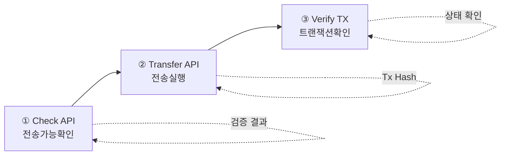

# 토큰 전송 가이드

이 가이드에서는 Pulse 네트워크에서 Security Token을 전송하는 방법을 설명합니다.

## 전송 조건

Security Token 전송을 위해서는 다음 조건이 충족되어야 합니다:

<CardGroup cols={2}>
  <Card title="송신자 조건" icon="user">
    - KYC 등록 완료
    - 충분한 잔액 보유
    - 잠금되지 않은 토큰
  </Card>
  <Card title="수신자 조건" icon="user-plus">
    - KYC 등록 완료
    - 유효한 지갑 주소
  </Card>
</CardGroup>

---

## 전송 플로우



---

## Step 1: 전송 가능 여부 확인

실제 전송 전에 전송 가능 여부를 먼저 확인합니다:

<CodeGroup>

```bash cURL
curl -X POST "https://api.stopulse.co.kr/main/v1/tokens/PULSE-ST-001/transfer/check" \
  -H "Authorization: Bearer {access_token}" \
  -H "Content-Type: application/json" \
  -d '{
    "from": "0xd14f723e859ec4f3edee57bf78ceb7c81de08dfb",
    "to": "0x734c49630caC28EaaC33e9722268e64cA80AbcFd",
    "value": "100"
  }'
```

```javascript JavaScript
async function checkTransfer(from, to, value) {
  const response = await fetch(
    'https://api.stopulse.co.kr/main/v1/tokens/PULSE-ST-001/transfer/check',
    {
      method: 'POST',
      headers: {
        'Authorization': `Bearer ${accessToken}`,
        'Content-Type': 'application/json'
      },
      body: JSON.stringify({ from, to, value })
    }
  );

  return await response.json();
}

const result = await checkTransfer(
  '0xd14f723e859ec4f3edee57bf78ceb7c81de08dfb',
  '0x734c49630caC28EaaC33e9722268e64cA80AbcFd',
  '100'
);

if (result.transferable) {
  console.log('전송 가능합니다.');
} else {
  console.log('전송 불가:', result.reason);
}
```

</CodeGroup>

### 전송 가능 응답

```json
{
  "transferable": true,
  "token": "PULSE-ST-001",
  "from": "0xd14f723e859ec4f3edee57bf78ceb7c81de08dfb",
  "to": "0x734c49630caC28EaaC33e9722268e64cA80AbcFd",
  "value": "100"
}
```

### 전송 불가 응답

```json
{
  "transferable": false,
  "reason": "RECEIVER_NOT_KYC_REGISTERED",
  "token": "PULSE-ST-001",
  "from": "0xd14f723e859ec4f3edee57bf78ceb7c81de08dfb",
  "to": "0x734c49630caC28EaaC33e9722268e64cA80AbcFd",
  "value": "100"
}
```

### 전송 불가 사유

| 사유 코드 | 설명 | 해결 방법 |
|----------|------|----------|
| `INSUFFICIENT_BALANCE` | 잔액 부족 | 전송 수량 조정 |
| `SENDER_NOT_KYC_REGISTERED` | 송신자 KYC 미등록 | 송신자 KYC 등록 |
| `RECEIVER_NOT_KYC_REGISTERED` | 수신자 KYC 미등록 | 수신자 KYC 등록 |
| `TOKENS_LOCKED` | 토큰 잠금 상태 | 잠금 해제 후 전송 |
| `SAME_ADDRESS` | 동일 주소 전송 | 다른 수신 주소 사용 |

---

## Step 2: 토큰 전송 실행

전송 가능 확인 후 실제 전송을 실행합니다:

<CodeGroup>

```bash cURL
curl -X POST "https://api.stopulse.co.kr/main/v1/tokens/PULSE-ST-001/transfer" \
  -H "Authorization: Bearer {access_token}" \
  -H "Content-Type: application/json" \
  -d '{
    "from": "0xd14f723e859ec4f3edee57bf78ceb7c81de08dfb",
    "to": "0x734c49630caC28EaaC33e9722268e64cA80AbcFd",
    "value": "100"
  }'
```

```javascript JavaScript
async function transferToken(from, to, value) {
  const response = await fetch(
    'https://api.stopulse.co.kr/main/v1/tokens/PULSE-ST-001/transfer',
    {
      method: 'POST',
      headers: {
        'Authorization': `Bearer ${accessToken}`,
        'Content-Type': 'application/json'
      },
      body: JSON.stringify({ from, to, value })
    }
  );

  return await response.json();
}

const result = await transferToken(
  '0xd14f723e859ec4f3edee57bf78ceb7c81de08dfb',
  '0x734c49630caC28EaaC33e9722268e64cA80AbcFd',
  '100'
);

console.log('Transaction Hash:', result.transactionHash);
console.log('Request ID:', result.requestId);
```

```python Python
import requests

url = "https://api.stopulse.co.kr/main/v1/tokens/PULSE-ST-001/transfer"
headers = {
    "Authorization": "Bearer {access_token}",
    "Content-Type": "application/json"
}
data = {
    "from": "0xd14f723e859ec4f3edee57bf78ceb7c81de08dfb",
    "to": "0x734c49630caC28EaaC33e9722268e64cA80AbcFd",
    "value": "100"
}

response = requests.post(url, headers=headers, json=data)
result = response.json()
print(f"Transaction Hash: {result['transactionHash']}")
```

</CodeGroup>

### 응답

```json
{
  "transactionHash": "0xabc123def456...",
  "requestId": "req-123456",
  "token": "PULSE-ST-001",
  "from": "0xd14f723e859ec4f3edee57bf78ceb7c81de08dfb",
  "to": "0x734c49630caC28EaaC33e9722268e64cA80AbcFd",
  "value": "100"
}
```

---

## Step 3: 트랜잭션 확인

전송 완료 후 트랜잭션 상태를 확인합니다:

```javascript
async function waitForConfirmation(txHash, maxAttempts = 10) {
  for (let i = 0; i < maxAttempts; i++) {
    const response = await fetch(
      `https://api.stopulse.co.kr/main/v1/transactions/${txHash}`,
      {
        headers: { 'Authorization': `Bearer ${accessToken}` }
      }
    );

    const tx = await response.json();

    if (tx.status === 'confirmed') {
      console.log('트랜잭션 확정:', tx.blockNumber);
      return tx;
    }

    if (tx.status === 'failed') {
      throw new Error(`트랜잭션 실패: ${tx.error?.message}`);
    }

    // 대기 후 재시도
    await new Promise(resolve => setTimeout(resolve, 1000));
  }

  throw new Error('트랜잭션 확인 시간 초과');
}

const confirmedTx = await waitForConfirmation('0xabc123def456...');
```

---

## 파티션 간 전송

동일 소유자의 다른 파티션으로 토큰을 이동할 수 있습니다:

```javascript
// 락업 파티션에서 일반 파티션으로 이동
const response = await fetch(
  'https://api.stopulse.co.kr/main/v1/tokens/PULSE-ST-001/transfer/partition',
  {
    method: 'POST',
    headers: {
      'Authorization': `Bearer ${accessToken}`,
      'Content-Type': 'application/json'
    },
    body: JSON.stringify({
      holder: '0xd14f723e859ec4f3edee57bf78ceb7c81de08dfb',
      fromPartition: '0x0000...0002',  // 락업 파티션
      toPartition: '0x0000...0001',    // 일반 파티션
      value: '50'
    })
  }
);
```

---

## 대량 전송

여러 수신자에게 동시에 전송해야 할 경우:

```javascript
async function batchTransfer(token, from, transfers) {
  const results = [];

  for (const transfer of transfers) {
    // 1. 전송 가능 여부 확인
    const checkResult = await checkTransfer(from, transfer.to, transfer.value);

    if (!checkResult.transferable) {
      results.push({
        to: transfer.to,
        success: false,
        reason: checkResult.reason
      });
      continue;
    }

    // 2. 전송 실행
    try {
      const txResult = await transferToken(from, transfer.to, transfer.value);
      results.push({
        to: transfer.to,
        success: true,
        transactionHash: txResult.transactionHash
      });
    } catch (error) {
      results.push({
        to: transfer.to,
        success: false,
        reason: error.message
      });
    }
  }

  return results;
}

// 사용 예시
const transfers = [
  { to: '0x111...', value: '100' },
  { to: '0x222...', value: '200' },
  { to: '0x333...', value: '150' },
];

const results = await batchTransfer('PULSE-ST-001', senderAddress, transfers);
console.log('전송 결과:', results);
```

---

## 전송 에러 처리

```javascript
async function safeTransfer(from, to, value) {
  try {
    // 1. 전송 가능 여부 확인
    const check = await checkTransfer(from, to, value);

    if (!check.transferable) {
      return {
        success: false,
        error: `전송 불가: ${check.reason}`,
        code: check.reason
      };
    }

    // 2. 전송 실행
    const result = await transferToken(from, to, value);

    // 3. 확인 대기
    const confirmed = await waitForConfirmation(result.transactionHash);

    return {
      success: true,
      transactionHash: result.transactionHash,
      blockNumber: confirmed.blockNumber
    };

  } catch (error) {
    return {
      success: false,
      error: error.message
    };
  }
}
```

---

## 전송 이력 조회

특정 주소의 전송 이력을 조회합니다:

```bash
curl -X GET "https://api.stopulse.co.kr/main/v1/tokens/PULSE-ST-001/holders/0xd14f.../transactions?type=transfer&limit=20" \
  -H "Authorization: Bearer {access_token}"
```

```json
{
  "token": "PULSE-ST-001",
  "holder": "0xd14f723e859ec4f3edee57bf78ceb7c81de08dfb",
  "transactions": [
    {
      "transactionHash": "0xabc123...",
      "type": "transfer",
      "direction": "out",
      "counterparty": "0x734c...",
      "value": "100",
      "timestamp": "2024-01-15T10:30:00Z"
    },
    {
      "transactionHash": "0xdef456...",
      "type": "transfer",
      "direction": "in",
      "counterparty": "0xa13F...",
      "value": "500",
      "timestamp": "2024-01-10T09:00:00Z"
    }
  ]
}
```

---

## 관련 API

<CardGroup cols={2}>
  <Card title="Transfer API" icon="arrow-right-arrow-left" href="/api-reference/operator-transfer">
    전송 가능 확인, 전송 실행
  </Card>
  <Card title="Token Holder API" icon="wallet" href="/api-reference/token-holder">
    잔액 조회, 파티션 조회
  </Card>
  <Card title="KYC API" icon="id-card" href="/api-reference/kyc">
    KYC 등록 상태 확인
  </Card>
  <Card title="Transaction API" icon="receipt" href="/api-reference/transaction">
    트랜잭션 상태 조회
  </Card>
</CardGroup>
