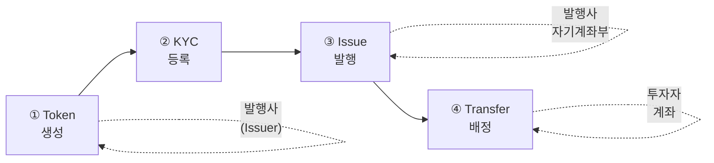

# 토큰 발행 가이드

이 가이드에서는 Pulse 네트워크에서 Security Token(ST)을 발행하는 전체 과정을 설명합니다.

## 발행 플로우 개요

<Tip>
  전체 시스템 아키텍처는 [인프라 아키텍처](/reference/architecture) 페이지에서 확인하세요.
</Tip>



## 사전 준비

<Steps>
  <Step title="네트워크 참여 신청">
    shs.block@shinhan.com으로 Pulse 네트워크 참여를 신청합니다.
  </Step>
  <Step title="Access Token 발급">
    계약 체결 후 Access Token을 발급받습니다.
  </Step>
  <Step title="키 생성">
    발행사의 Issuer Key와 Operator Key를 생성합니다.
  </Step>
</Steps>

---

## Step 1: 토큰 생성 신청

토큰 생성은 Pulse 운영팀을 통해 진행됩니다. 다음 정보를 준비하세요:

<CardGroup cols={2}>
  <Card title="필수 정보" icon="list-check">
    - 토큰 심볼 (예: `PULSE-ST-001`)
    - 토큰 이름
    - 총 발행 예정량
    - 발행사 지갑 주소 (자기계좌부)
  </Card>
  <Card title="선택 정보" icon="list">
    - 파티션 구성
    - 문서 (투자설명서 등)
    - 메타데이터
  </Card>
</CardGroup>

---

## Step 2: KYC 등록

토큰을 수령할 모든 주소는 사전에 KYC 등록이 필요합니다.

### 발행사 주소 KYC 등록

```bash
curl -X POST "https://api.stopulse.co.kr/main/v1/kyc/PULSE-ST-001/0xa13Ff1b6930c25d96baf2165A9f3B83d057D2D73" \
  -H "Authorization: Bearer {access_token}" \
  -H "Content-Type: application/json"
```

### 투자자 주소 KYC 등록

```javascript
// 투자자 KYC 일괄 등록
const investors = [
  '0xd14f723e859ec4f3edee57bf78ceb7c81de08dfb',
  '0x734c49630caC28EaaC33e9722268e64cA80AbcFd',
  // ...
];

for (const investor of investors) {
  await fetch(
    `https://api.stopulse.co.kr/main/v1/kyc/PULSE-ST-001/${investor}`,
    {
      method: 'POST',
      headers: {
        'Authorization': `Bearer ${accessToken}`,
        'Content-Type': 'application/json'
      }
    }
  );
}
```

---

## Step 3: 토큰 발행

### 발행 전 확인

```bash
# 발행 가능 여부 확인
curl -X GET "https://api.stopulse.co.kr/main/v1/tokens/PULSE-ST-001/issuable" \
  -H "Authorization: Bearer {access_token}"
```

```json
{
  "token": "PULSE-ST-001",
  "isIssuable": true
}
```

### 발행 실행

발행사 자기계좌부로 토큰을 발행합니다:

<CodeGroup>

```bash cURL
curl -X POST "https://api.stopulse.co.kr/main/v1/tokens/PULSE-ST-001/issue" \
  -H "Authorization: Bearer {access_token}" \
  -H "Content-Type: application/json" \
  -d '{
    "to": "0xa13Ff1b6930c25d96baf2165A9f3B83d057D2D73",
    "value": "1000000"
  }'
```

```javascript JavaScript
const response = await fetch(
  'https://api.stopulse.co.kr/main/v1/tokens/PULSE-ST-001/issue',
  {
    method: 'POST',
    headers: {
      'Authorization': 'Bearer {access_token}',
      'Content-Type': 'application/json'
    },
    body: JSON.stringify({
      to: '0xa13Ff1b6930c25d96baf2165A9f3B83d057D2D73', // 발행사 자기계좌부
      value: '1000000' // 총 발행량
    })
  }
);

const result = await response.json();
console.log('Transaction Hash:', result.transactionHash);
```

</CodeGroup>

### 발행 결과 확인

```bash
# 토큰 정보 조회
curl -X GET "https://api.stopulse.co.kr/main/v1/tokens/PULSE-ST-001/info" \
  -H "Authorization: Bearer {access_token}"
```

```json
{
  "symbol": "PULSE-ST-001",
  "name": "Sample Security Token",
  "totalSupply": "1000000",
  "decimals": 0,
  "issuer": "0xa13Ff1b6930c25d96baf2165A9f3B83d057D2D73",
  "isIssuable": true
}
```

---

## Step 4: 투자자에게 토큰 배정

발행된 토큰을 투자자에게 배정합니다:

```javascript
// 투자자 배정 정보
const allocations = [
  { investor: '0xd14f...', amount: '50000' },
  { investor: '0x734c...', amount: '30000' },
  { investor: '0x9a8b...', amount: '20000' },
];

// 배정 실행
for (const allocation of allocations) {
  const response = await fetch(
    'https://api.stopulse.co.kr/main/v1/tokens/PULSE-ST-001/transfer',
    {
      method: 'POST',
      headers: {
        'Authorization': `Bearer ${accessToken}`,
        'Content-Type': 'application/json'
      },
      body: JSON.stringify({
        from: '0xa13Ff1b6930c25d96baf2165A9f3B83d057D2D73', // 발행사
        to: allocation.investor,
        value: allocation.amount
      })
    }
  );

  const result = await response.json();
  console.log(`${allocation.investor}: ${result.transactionHash}`);
}
```

---

## Step 5: 문서 등록 (선택)

투자설명서 등 관련 문서를 토큰에 등록합니다:

```bash
curl -X POST "https://api.stopulse.co.kr/main/v1/tokens/PULSE-ST-001/documents" \
  -H "Authorization: Bearer {access_token}" \
  -H "Content-Type: application/json" \
  -d '{
    "name": "prospectus",
    "uri": "https://example.com/prospectus.pdf",
    "documentHash": "0x7a8b9c..."
  }'
```

---

## Step 6: 추가 발행 종료 (선택)

모든 발행이 완료되면 추가 발행을 영구적으로 중지할 수 있습니다:

<Warning>
  이 작업은 되돌릴 수 없습니다. 실행 후에는 토큰 추가 발행이 불가능합니다.
</Warning>

```bash
curl -X POST "https://api.stopulse.co.kr/main/v1/tokens/PULSE-ST-001/finishIssuance" \
  -H "Authorization: Bearer {access_token}"
```

---

## 파티션을 활용한 발행

파티션을 사용하면 동일 토큰 내에서 서로 다른 권리나 상태를 구분할 수 있습니다:

```javascript
// 일반 파티션으로 발행
await fetch('https://api.stopulse.co.kr/main/v1/tokens/PULSE-ST-001/issue', {
  method: 'POST',
  headers: {
    'Authorization': 'Bearer {access_token}',
    'Content-Type': 'application/json'
  },
  body: JSON.stringify({
    partition: '0x0000000000000000000000000000000000000000000000000000000000000001',
    to: '0xa13Ff1b6930c25d96baf2165A9f3B83d057D2D73',
    value: '500000'
  })
});

// 락업 파티션으로 발행
await fetch('https://api.stopulse.co.kr/main/v1/tokens/PULSE-ST-001/issue', {
  method: 'POST',
  headers: {
    'Authorization': 'Bearer {access_token}',
    'Content-Type': 'application/json'
  },
  body: JSON.stringify({
    partition: '0x0000000000000000000000000000000000000000000000000000000000000002',
    to: '0xa13Ff1b6930c25d96baf2165A9f3B83d057D2D73',
    value: '500000'
  })
});
```

---

## 발행 체크리스트

<AccordionGroup>
  <Accordion title="발행 전 체크리스트">
    - [ ] Access Token 발급 완료
    - [ ] 발행사 지갑 주소 생성
    - [ ] 토큰 생성 신청 및 승인
    - [ ] 발행사 주소 KYC 등록
    - [ ] 투자자 KYC 등록
  </Accordion>
  <Accordion title="발행 후 체크리스트">
    - [ ] 토큰 정보 조회로 발행량 확인
    - [ ] 발행사 잔액 확인
    - [ ] 투자자 배정 완료
    - [ ] 문서 등록 (필요시)
    - [ ] Block Explorer에서 트랜잭션 확인
  </Accordion>
</AccordionGroup>

---

## 관련 API

<CardGroup cols={2}>
  <Card title="Token API" icon="coins" href="/issuance/token-api">
    토큰 발행, 조회, 문서 관리
  </Card>
  <Card title="KYC API" icon="id-card" href="/account/kyc-api">
    KYC 등록, 해제, 확인
  </Card>
  <Card title="Transfer API" icon="arrow-right-arrow-left" href="/trading/transfer-api">
    토큰 전송
  </Card>
  <Card title="Transaction API" icon="receipt" href="/reference/transaction-api">
    트랜잭션 조회
  </Card>
</CardGroup>
