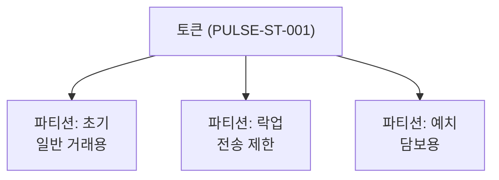

# 파티션 관리

파티션(Partition)은 토큰을 논리적으로 구분하는 단위입니다. 동일한 토큰이라도 파티션에 따라 다른 전송 규칙이나 제한을 적용할 수 있습니다.

## 파티션 개념



### 파티션 활용 예시

| 파티션 이름 | 용도 | 특징 |
|------------|------|------|
| **초기** | 일반 거래용 | 자유로운 전송 가능 |
| **락업** | 보호예수 물량 | 특정 기간 전송 제한 |
| **예치** | 담보 설정용 | 담보 해제 전 전송 불가 |

---

## 기본 파티션 조회

토큰의 기본 파티션을 조회합니다.

### Request

```bash
GET /main/v1/tokens/{tokenSymbol}/default-partitions
```

### Response

```json 200
{
  "partitions": [
    {
      "name": "초기",
      "partition": "0x0000000000000000000000000000000000000000000000000000000000000001"
    }
  ]
}
```

---

## 기본 파티션 설정

토큰의 기본 파티션을 설정합니다.

### Request

```bash
PUT /main/v1/tokens/{tokenSymbol}/default-partitions
```

### Body

```json
{
  "partitionName": "초기"
}
```

### Response

```json 200
{
  "transactionHash": "0x...",
  "requestId": "PARTITION:..."
}
```

---

## 파티션 목록 조회

토큰에 등록된 모든 파티션 목록을 조회합니다.

### Request

```bash
GET /main/v1/tokens/{tokenSymbol}/partitions
```

### Response

```json 200
{
  "partitions": [
    {
      "name": "초기",
      "partition": "0x0000...0001"
    },
    {
      "name": "락업",
      "partition": "0x0000...0002"
    }
  ]
}
```

---

## 파티션 생성

새로운 파티션을 생성합니다.

### Request

```bash
POST /main/v1/tokens/{tokenSymbol}/partitions
```

### Body

```json
{
  "partitionName": "신규파티션"
}
```

### Example

<CodeGroup>

```bash cURL
curl -X POST "https://api.stopulse.co.kr/main/v1/tokens/PULSE-ST-001/partitions" \
  -H "Authorization: Bearer {access_token}" \
  -H "Content-Type: application/json" \
  -d '{
    "partitionName": "락업"
  }'
```

```javascript JavaScript
const response = await fetch(
  'https://api.stopulse.co.kr/main/v1/tokens/PULSE-ST-001/partitions',
  {
    method: 'POST',
    headers: {
      'Authorization': 'Bearer {access_token}',
      'Content-Type': 'application/json'
    },
    body: JSON.stringify({
      partitionName: '락업'
    })
  }
);
```

</CodeGroup>

### Response

```json 201
{
  "transactionHash": "0x...",
  "requestId": "PARTITION:..."
}
```

---

## 파티션 수정

기존 파티션의 이름을 변경합니다.

### Request

```bash
PUT /main/v1/tokens/{tokenSymbol}/partitions
```

### Body

```json
{
  "oldPartitionName": "기존이름",
  "newPartitionName": "새이름"
}
```

### Response

```json 200
{
  "transactionHash": "0x...",
  "requestId": "PARTITION:..."
}
```

---

## 파티션별 총 공급량 조회

특정 파티션에 발행된 토큰 총량을 조회합니다.

### Request

```bash
GET /main/v1/tokens/{tokenSymbol}/partitions/{partition}/supply
```

### Response

```json 200
{
  "partition": "0x0000...0001",
  "totalSupply": "500000"
}
```

---

## 에러 응답

| HTTP Status | 에러 코드 | 설명 |
|-------------|----------|------|
| 400 | `INVALID_PARTITION_NAME` | 유효하지 않은 파티션 이름 |
| 404 | `TOKEN_NOT_FOUND` | 토큰이 존재하지 않음 |
| 404 | `PARTITION_NOT_FOUND` | 파티션이 존재하지 않음 |
| 409 | `PARTITION_ALREADY_EXISTS` | 이미 존재하는 파티션 이름 |

---

## 관련 문서

<CardGroup cols={2}>
  <Card title="Token API" icon="coins" href="/issuance/token-api">
    토큰 발행 및 환수
  </Card>
  <Card title="토큰 타입" icon="tag" href="/reference/token-types">
    ST/DT 토큰 타입 이해하기
  </Card>
</CardGroup>
