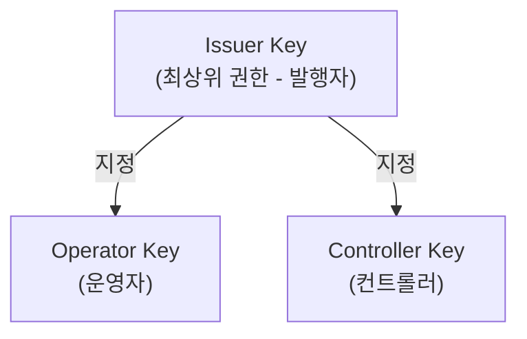
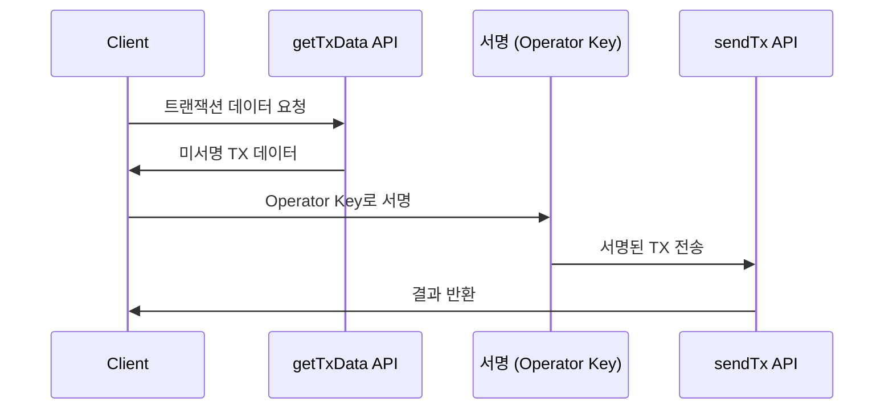

# Operator 권한 이해

Pulse 인프라에서는 트랜잭션의 목적과 권한에 따라 **3가지 유형의 키**가 사용됩니다. 이 문서에서는 일상적인 토큰 운영을 담당하는 **Operator** 역할을 중심으로 설명합니다.

---

## 키 유형 개요



| 역할 | 담당자 | 주요 행위 |
|------|--------|----------|
| **Issuer** | 혁금사업자 (Pulse-BCG 대행) | 토큰 발행, 소각, 권한 관리 |
| **Operator** | 발행사 / 유통사 | 전송, Swap, 조회 |
| **Controller** | 계좌관리기관 | 강제 전송, 동결, 압류 |

---

## Operator Key (운영자)

**Operator Key**는 일상적인 토큰 운영 업무를 수행하는 키입니다.

### 담당자

- 발행사
- 유통사 (장외거래중개업자)

### 가능한 행위

| 행위 | 설명 |
|------|------|
| **토큰 전송** | Transfer 트랜잭션 서명 |
| **토큰 Swap** | DT ↔ ST 교환 |
| **잔액 조회** | 투자자 잔액 확인 |
| **전송 가능 여부 확인** | Transfer 가능 여부 사전 검증 |

### 키 관리 위치

| 환경 | 저장 위치 |
|------|----------|
| **클라우드** | AWS KMS |
| **온프레미스** | 금융사 내부 HSM |

---

## Issuer Key (발행자)

**Issuer Key**는 토큰 발행 및 컨트랙트 관리 권한을 가진 최상위 키입니다.

### 담당자

- 혁신금융사업자
- Pulse-BCG 대행

### 가능한 행위

<CardGroup cols={2}>
  <Card title="토큰 발행" icon="plus">
    새로운 토큰 발행 (Issue)
  </Card>
  <Card title="토큰 소각" icon="fire">
    토큰 소각 (Burn)
  </Card>
  <Card title="전송 제한 설정" icon="lock">
    토큰 이체 제한 조건 설정
  </Card>
  <Card title="컨트롤러 지정" icon="user-shield">
    Controller 권한 부여
  </Card>
  <Card title="운영자 지정" icon="user-gear">
    Operator 권한 부여
  </Card>
  <Card title="컨트랙트 업그레이드" icon="arrow-up">
    스마트 컨트랙트 로직 업데이트
  </Card>
</CardGroup>

### 보안 관리

<Warning>
  Issuer Key는 가장 높은 권한을 가지므로 최고 수준의 보안이 필요합니다.
</Warning>

| 보안 수준 | 관리 방식 |
|----------|----------|
| **저장소** | AWS KMS / Hardware Security Module (HSM) |
| **접근** | 다중 서명 (Multi-sig) 필수 |
| **사용** | 오프라인 서명 권장 |

---

## Controller Key (컨트롤러)

**Controller Key**는 규제 준수 및 법적 조치를 위한 특수 권한을 가진 키입니다.

### 담당자

- 계좌관리기관 (증권사)

### 가능한 행위

<CardGroup cols={3}>
  <Card title="강제 전송" icon="arrow-right">
    법적 조치에 따른 토큰 이동
  </Card>
  <Card title="토큰 동결" icon="snowflake">
    특정 계정의 토큰 거래 중지
  </Card>
  <Card title="토큰 압류" icon="gavel">
    법원 명령에 따른 압류
  </Card>
</CardGroup>

### 사용 조건

Controller 권한은 다음과 같은 경우에만 사용됩니다:

1. **법원 명령**: 압류, 가처분 등
2. **금융당국 요청**: 규제 준수 조치
3. **AML/CFT 조치**: 자금세탁방지, 테러자금조달방지
4. **상속 처리**: 투자자 사망 시 권리 이전

<Note>
  Controller 권한 사용 시 모든 행위는 감사 로그에 기록됩니다.
</Note>

---

## 트랜잭션 서명 흐름

Operator가 토큰 전송을 수행하는 흐름:



### 코드 예시

```javascript
// 1. 트랜잭션 데이터 생성 요청
const txData = await fetch('/main/v1/transfer/tx/data', {
  method: 'POST',
  body: JSON.stringify({
    token: 'PULSE-ST-001',
    from: '0x...',
    to: '0x...',
    value: '100'
  })
});

// 2. Operator Key로 서명
const signedTx = await wallet.signTransaction(txData);

// 3. 서명된 트랜잭션 전송
const result = await fetch('/main/v1/transaction/send', {
  method: 'POST',
  body: JSON.stringify({
    signedTransaction: signedTx
  })
});
```

---

## 보안 권장사항

<Steps>
  <Step title="키 분리">
    Issuer, Operator, Controller 키를 물리적으로 분리된 환경에서 관리
  </Step>
  <Step title="다중 서명">
    중요한 작업(발행, 소각)은 다중 서명 적용
  </Step>
  <Step title="접근 로그">
    모든 키 사용 기록을 감사 로그에 저장
  </Step>
  <Step title="주기적 교체">
    Operator Key는 주기적으로 교체 권장
  </Step>
</Steps>

---

## 관련 문서

<CardGroup cols={2}>
  <Card title="Operator API" icon="code" href="/operator/operator-api">
    Operator API 사용법
  </Card>
  <Card title="Transfer API" icon="paper-plane" href="/trading/transfer-api">
    토큰 전송 API
  </Card>
  <Card title="Swap API" icon="right-left" href="/trading/swap-api">
    토큰 스왑 API
  </Card>
  <Card title="Kafka 연동" icon="message" href="/operator/kafka-integration">
    이벤트 수신
  </Card>
</CardGroup>
