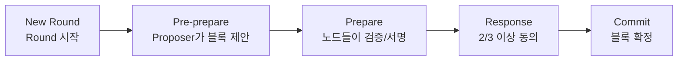
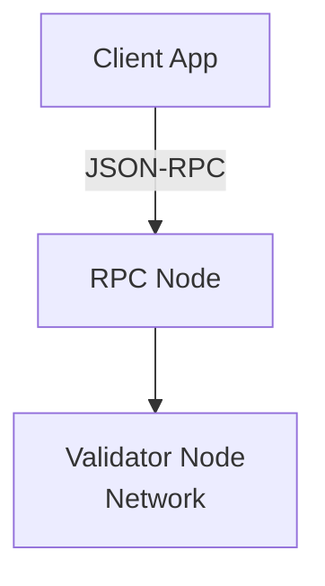
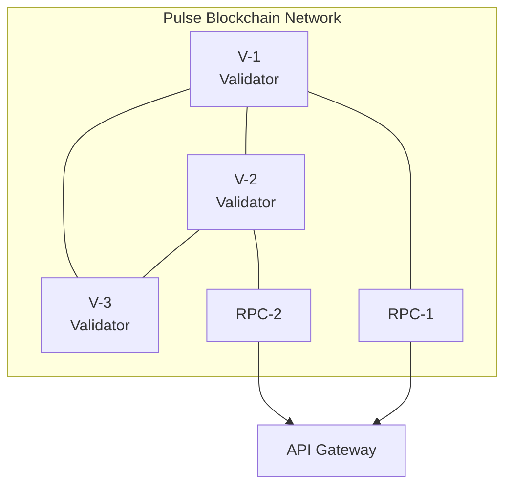

# 블록체인 구조

Pulse는 **Hyperledger Besu** 기반의 프라이빗 블록체인 네트워크입니다. EVM(Ethereum Virtual Machine) 호환으로 이더리움 생태계의 도구와 표준을 활용할 수 있습니다.

## 합의 알고리즘 (Consensus)

### QBFT (Quorum Byzantine Fault Tolerance)

Pulse는 **QBFT** 합의 알고리즘을 사용합니다. 이는 프라이빗 블록체인에 최적화된 엔터프라이즈급 합의 방식입니다.

#### BFT 알고리즘 비교

| 알고리즘 | 특징 | Pulse 적합성 |
|---------|------|-------------|
| **PoW** | 채굴 경쟁, 높은 전력 소모 | ❌ 비효율적 |
| **PoS** | 지분 기반, 블록 분기 가능 | ❌ 즉시 Finality 불가 |
| **PBFT** | 다수결 합의, 빠른 Finality | △ 노드 권한 제한 불가 |
| **IBFT** | PBFT 변형, 동적 노드 구성 | △ 모든 노드 검증 참여 |
| **QBFT** | IBFT 개선, 권한 노드 지정 | ✅ **채택** |

#### QBFT 특징

<CardGroup cols={2}>
  <Card title="즉각적인 Finality" icon="check-double">
    다수결로 블록 생성, 분기 없음
  </Card>
  <Card title="권한 기반 Proposer" icon="user-shield">
    금융기관만 블록 제안 가능
  </Card>
  <Card title="낮은 에너지 소비" icon="leaf">
    채굴 경쟁 없음
  </Card>
  <Card title="빠른 트랜잭션" icon="bolt">
    수 초 내 블록 확정
  </Card>
</CardGroup>

### Byzantine Fault Tolerance

BFT 알고리즘은 악의적인 노드가 전체의 1/3 미만일 때 합의를 보장합니다:

| 총 노드 수 | 허용 악의적 노드 |
|-----------|----------------|
| 4개 | 1개 |
| 7개 | 2개 |
| 10개 | 3개 |

**공식**: `총 노드 수 = 3f + 1` (f = 허용 가능한 악의적 노드 수)

### 합의 프로세스

## 노드 구조

### Validator Node

블록 검증 및 생성에 참여하는 노드입니다.

**현재 참여 금융기관:**
- 신한투자증권
- SK증권

<Note>
  금융위 가이드라인에 따라 노드의 51% 이상이 금융기관으로 구성되어야 합니다.
</Note>

### RPC Node

외부 애플리케이션과의 통신을 담당하는 노드입니다:

**RPC Node 역할:**
- API Gateway에서 오는 요청 처리
- 트랜잭션 전파
- 블록체인 상태 조회

## 네트워크 토폴로지

**V**: Validator Node | **RPC**: RPC Node

## 트랜잭션 유형

### Write Transaction

블록체인에 데이터를 기록하거나 상태를 변경하는 트랜잭션:

- 토큰 발행 (Issue)
- 토큰 전송 (Transfer)
- 토큰 환수 (Redeem)
- Swap

### Read Transaction (Query)

블록체인 원장에서 데이터를 조회하는 트랜잭션:

- 잔액 조회
- 토큰 정보 조회
- 파티션 목록 조회

<Info>
  Read Transaction은 블록체인 상태를 변경하지 않으므로 Gas가 소모되지 않습니다.
</Info>

## Block Explorer

Pulse는 **Blockscout** 기반의 Block Explorer를 제공합니다.

### 확인 가능한 정보

**블록 정보:**
- 블록 높이
- 처리 상태 (Success, Pending, Denied)
- 생성 시간
- 포함된 트랜잭션 수
- 블록 사이즈

**트랜잭션 정보:**
- 트랜잭션 Hash
- From / To 주소
- Value (전송량)
- Gas 사용량
- Input Data
- Nonce

**스마트 컨트랙트 정보:**
- 상품 이름, 심볼
- 총 발행량
- 발행사
- 보유자 목록

<Card title="Block Explorer 사용법" icon="cube" href="/appendix/block-explorer">
  Block Explorer 접속 및 사용 방법 알아보기
</Card>
