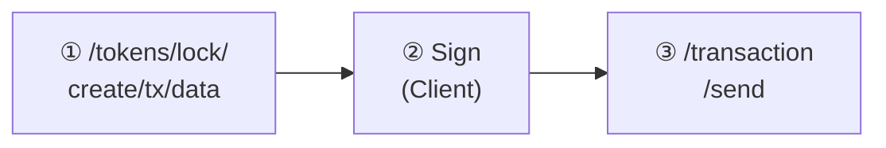

# Lock API

Lock API는 토큰의 잠금(Lock) 및 해제(Unlock)를 위한 트랜잭션 데이터를 생성합니다. 잠금된 토큰은 전송이 불가능합니다. **Operator** 권한이 필요합니다.

## 잠금 용도

<CardGroup cols={2}>
  <Card title="질권 설정" icon="handshake">
    담보 목적의 토큰 잠금
  </Card>
  <Card title="배당/이자 지급" icon="money-bill">
    권리확정일 기준 잠금
  </Card>
  <Card title="락업 기간" icon="clock">
    발행 후 일정 기간 전송 제한
  </Card>
  <Card title="법적 동결" icon="gavel">
    법원 명령에 따른 자산 동결
  </Card>
</CardGroup>

---

## 토큰 잠금 트랜잭션 데이터 생성

토큰 잠금을 위한 트랜잭션 데이터를 생성합니다.

### Request

```bash
POST /main/v1/tokens/lock/create/tx/data
```

### Body Parameters

<ParamField body="tokenSymbol" type="string" required>
  토큰 심볼 (예: `PULSE-ST-001`)
</ParamField>

<ParamField body="partition" type="string" required>
  파티션 ID
</ParamField>

<ParamField body="holder" type="string" required>
  잠금 대상 지갑 주소
</ParamField>

<ParamField body="amount" type="number" required>
  잠금 수량
</ParamField>

<ParamField body="data" type="string">
  추가 데이터 (잠금 사유 등)
</ParamField>

### Example

<CodeGroup>

```bash cURL
curl -X POST "https://api.stopulse.co.kr/main/v1/tokens/lock/create/tx/data" \
  -H "Authorization: Bearer {access_token}" \
  -H "Content-Type: application/json" \
  -d '{
    "tokenSymbol": "PULSE-ST-001",
    "partition": "0x0000000000000000000000000000000000000000000000000000000000000001",
    "holder": "0xFE3B557E8Fb62b89F4916B721be55cEb828dBd73",
    "amount": 500,
    "data": ""
  }'
```

```javascript JavaScript
const response = await fetch(
  'https://api.stopulse.co.kr/main/v1/tokens/lock/create/tx/data',
  {
    method: 'POST',
    headers: {
      'Authorization': 'Bearer {access_token}',
      'Content-Type': 'application/json'
    },
    body: JSON.stringify({
      tokenSymbol: 'PULSE-ST-001',
      partition: '0x0000000000000000000000000000000000000000000000000000000000000001',
      holder: '0xFE3B557E8Fb62b89F4916B721be55cEb828dBd73',
      amount: 500,
      data: ''
    })
  }
);
```

```python Python
import requests

url = "https://api.stopulse.co.kr/main/v1/tokens/lock/create/tx/data"
headers = {
    "Authorization": "Bearer {access_token}",
    "Content-Type": "application/json"
}
data = {
    "tokenSymbol": "PULSE-ST-001",
    "partition": "0x0000000000000000000000000000000000000000000000000000000000000001",
    "holder": "0xFE3B557E8Fb62b89F4916B721be55cEb828dBd73",
    "amount": 500,
    "data": ""
}

response = requests.post(url, headers=headers, json=data)
```

</CodeGroup>

### Response

```json 200
{
  "to": "0xContractAddress...",
  "data": "0xEncodedTransactionData...",
  "gas": "100000"
}
```

---

## 토큰 잠금 해제 트랜잭션 데이터 생성

잠금된 토큰을 해제하기 위한 트랜잭션 데이터를 생성합니다.

### Request

```bash
POST /main/v1/tokens/lock/remove/tx/data
```

### Body Parameters

<ParamField body="tokenSymbol" type="string" required>
  토큰 심볼
</ParamField>

<ParamField body="partition" type="string" required>
  파티션 ID
</ParamField>

<ParamField body="holder" type="string" required>
  잠금 해제 대상 지갑 주소
</ParamField>

<ParamField body="amount" type="number" required>
  해제 수량
</ParamField>

<ParamField body="data" type="string">
  추가 데이터
</ParamField>

### Example

<CodeGroup>

```bash cURL
curl -X POST "https://api.stopulse.co.kr/main/v1/tokens/lock/remove/tx/data" \
  -H "Authorization: Bearer {access_token}" \
  -H "Content-Type: application/json" \
  -d '{
    "tokenSymbol": "PULSE-ST-001",
    "partition": "0x0000000000000000000000000000000000000000000000000000000000000001",
    "holder": "0xFE3B557E8Fb62b89F4916B721be55cEb828dBd73",
    "amount": 500,
    "data": ""
  }'
```

```javascript JavaScript
const response = await fetch(
  'https://api.stopulse.co.kr/main/v1/tokens/lock/remove/tx/data',
  {
    method: 'POST',
    headers: {
      'Authorization': 'Bearer {access_token}',
      'Content-Type': 'application/json'
    },
    body: JSON.stringify({
      tokenSymbol: 'PULSE-ST-001',
      partition: '0x0000000000000000000000000000000000000000000000000000000000000001',
      holder: '0xFE3B557E8Fb62b89F4916B721be55cEb828dBd73',
      amount: 500,
      data: ''
    })
  }
);
```

</CodeGroup>

### Response

```json 200
{
  "to": "0xContractAddress...",
  "data": "0xEncodedTransactionData...",
  "gas": "100000"
}
```

<Note>
  반환된 트랜잭션 데이터는 서명 후 `/transaction/send` API로 전송해야 합니다.
</Note>

---

## 잠금/해제 플로우

**토큰 잠금 플로우:**



**토큰 해제 플로우:**


---

## 잠금 잔액 조회

특정 파티션에서 잠금 처리된 토큰 잔액을 조회합니다.

### Request

```bash
GET /main/v1/holders/{holder}/tokens/{tokenSymbol}/partitions/{partition}/locked/balance
```

### Example

```bash cURL
curl -X GET "https://api.stopulse.co.kr/main/v1/holders/0xFE3B557E8Fb62b89F4916B721be55cEb828dBd73/tokens/PULSE-ST-001/partitions/0x0000000000000000000000000000000000000000000000000000000000000001/locked/balance" \
  -H "Authorization: Bearer {access_token}"
```

### Response

```json 200
"500"
```

<Note>
  잠금 잔액은 전송 가능 잔액에서 제외됩니다.

  **전송 가능 잔액** = 파티션 잔액 - 잠금 잔액
</Note>

---

## 잔액 계산 예시

```javascript
async function getAvailableBalance(holder, token, partition) {
  // 파티션 잔액 조회
  const totalBalance = await fetch(
    `https://api.stopulse.co.kr/main/v1/holders/${holder}/tokens/${token}/partitions/${partition}/balance`,
    { headers: { 'Authorization': `Bearer ${accessToken}` } }
  ).then(r => r.json());

  // 잠금 잔액 조회
  const lockedBalance = await fetch(
    `https://api.stopulse.co.kr/main/v1/holders/${holder}/tokens/${token}/partitions/${partition}/locked/balance`,
    { headers: { 'Authorization': `Bearer ${accessToken}` } }
  ).then(r => r.json());

  // 전송 가능 잔액 계산
  const availableBalance = BigInt(totalBalance) - BigInt(lockedBalance);

  return {
    total: totalBalance,
    locked: lockedBalance,
    available: availableBalance.toString()
  };
}
```

---

## 에러 응답

| HTTP Status | 에러 코드 | 설명 |
|-------------|----------|------|
| 400 | `INSUFFICIENT_BALANCE` | 잠금 수량이 가용 잔액 초과 |
| 400 | `INVALID_ADDRESS` | 유효하지 않은 지갑 주소 |
| 400 | `LOCK_NOT_FOUND` | 잠금 정보를 찾을 수 없음 |
| 400 | `ALREADY_UNLOCKED` | 이미 해제된 잠금 |
| 403 | `NOT_OPERATOR` | Operator 권한 없음 |
| 404 | `TOKEN_NOT_FOUND` | 토큰이 존재하지 않음 |
