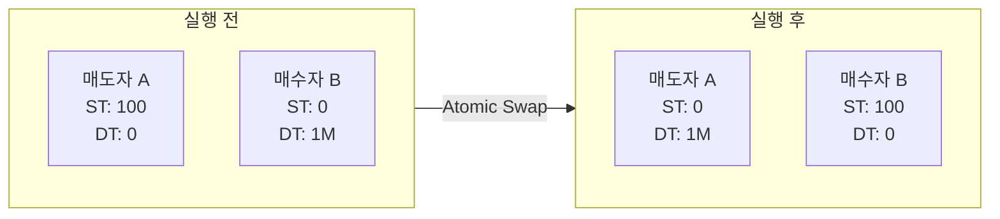
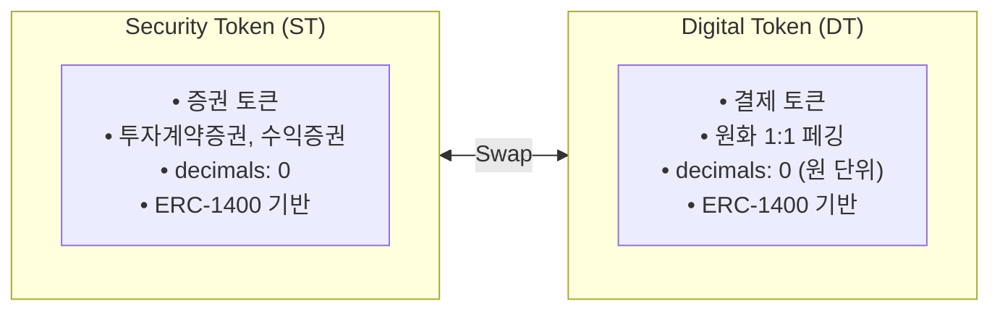
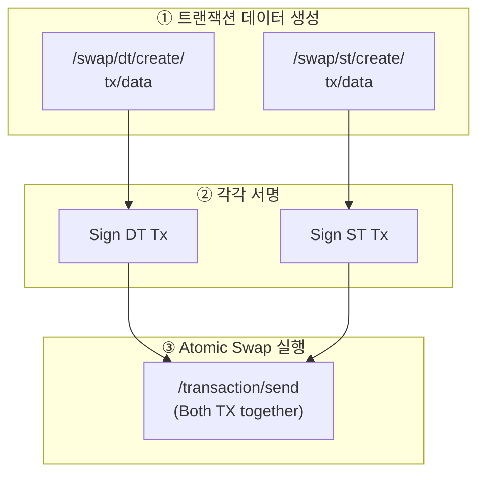

# Swap / DvP API

Swap API는 Security Token(ST)과 Digital Token(DT) 간의 교환을 위한 트랜잭션 데이터를 생성합니다. DvP(Delivery versus Payment) 방식으로 증권 인도와 대금 지급이 동시에 이루어집니다.

---

## DvP란?

**DvP(Delivery versus Payment)**는 증권 인도와 대금 지급이 동시에 이루어지는 결제 방식입니다.

<CardGroup cols={2}>
  <Card title="기존 결제 방식" icon="clock">
    - T+2 결제 (거래 후 2영업일)
    - 결제 리스크 존재
    - 중앙 기관 필요
  </Card>
  <Card title="Pulse DvP" icon="bolt">
    - T+0 결제 (즉시)
    - 원자적 교환 (Atomic Swap)
    - 결제 리스크 제거
  </Card>
</CardGroup>

---

## Atomic Swap 원리

Pulse의 DvP는 **Atomic Swap** 기술을 사용합니다. 두 전송이 모두 성공하거나 모두 실패합니다:



<Note>
  Atomic Swap은 스마트 컨트랙트 레벨에서 처리되므로, 한쪽만 실행되는 상황이 발생하지 않습니다.
</Note>

---

## ST와 DT

### Security Token (ST)

증권을 토큰화한 것:
- 투자계약증권, 수익증권, 채무증권 등
- 실물 증권의 권리를 표상
- KYC 등록된 주소만 보유 가능

### Digital Token (DT)

결제용 토큰:
- 원화와 1:1 페깅
- 결제 대금 지급에 사용
- KYC 등록 필수



---

## DvP 스왑 플로우



**결과**: ST와 DT가 원자적으로 교환 (동시 성공 또는 동시 실패)

---

## DT 스왑 트랜잭션 데이터 생성

DT(Digital Token) 전송을 위한 스왑 트랜잭션 데이터를 생성합니다.

### Request

```bash
POST /main/v1/swap/dt/create/tx/data
```

### Body Parameters

<ParamField body="tokenSymbol" type="string" required>
  DT 토큰 심볼 (`DT`)
</ParamField>

<ParamField body="partition" type="string" required>
  파티션 ID
</ParamField>

<ParamField body="from" type="string" required>
  DT 송신자 주소 (매수자)
</ParamField>

<ParamField body="to" type="string" required>
  DT 수신자 주소 (매도자)
</ParamField>

<ParamField body="amount" type="number" required>
  DT 전송 수량 (결제 금액)
</ParamField>

<ParamField body="data" type="string">
  추가 데이터
</ParamField>

### Example

<CodeGroup>

```bash cURL
curl -X POST "https://api.stopulse.co.kr/main/v1/swap/dt/create/tx/data" \
  -H "Authorization: Bearer {access_token}" \
  -H "Content-Type: application/json" \
  -d '{
    "tokenSymbol": "DT",
    "partition": "0x0000...0001",
    "from": "0xBuyer...",
    "to": "0xSeller...",
    "amount": 1000000,
    "data": ""
  }'
```

```javascript JavaScript
const response = await fetch(
  'https://api.stopulse.co.kr/main/v1/swap/dt/create/tx/data',
  {
    method: 'POST',
    headers: {
      'Authorization': 'Bearer {access_token}',
      'Content-Type': 'application/json'
    },
    body: JSON.stringify({
      tokenSymbol: 'DT',
      partition: '0x0000...0001',
      from: '0xBuyer...',   // 매수자: DT 지급
      to: '0xSeller...',     // 매도자: DT 수령
      amount: 1000000,       // 결제 금액
      data: ''
    })
  }
);
```

</CodeGroup>

### Response

```json 200
{
  "to": "0xContractAddress...",
  "data": "0xEncodedTransactionData...",
  "gas": "150000"
}
```

---

## ST 스왑 트랜잭션 데이터 생성

ST(Security Token) 전송을 위한 스왑 트랜잭션 데이터를 생성합니다.

### Request

```bash
POST /main/v1/swap/st/create/tx/data
```

### Body Parameters

<ParamField body="tokenSymbol" type="string" required>
  ST 토큰 심볼
</ParamField>

<ParamField body="partition" type="string" required>
  파티션 ID
</ParamField>

<ParamField body="from" type="string" required>
  ST 송신자 주소 (매도자)
</ParamField>

<ParamField body="to" type="string" required>
  ST 수신자 주소 (매수자)
</ParamField>

<ParamField body="amount" type="number" required>
  ST 전송 수량
</ParamField>

<ParamField body="data" type="string">
  추가 데이터
</ParamField>

### Example

```bash cURL
curl -X POST "https://api.stopulse.co.kr/main/v1/swap/st/create/tx/data" \
  -H "Authorization: Bearer {access_token}" \
  -H "Content-Type: application/json" \
  -d '{
    "tokenSymbol": "PULSE-ST-001",
    "partition": "0x0000...0001",
    "from": "0xSeller...",
    "to": "0xBuyer...",
    "amount": 100,
    "data": ""
  }'
```

### Response

```json 200
{
  "to": "0xContractAddress...",
  "data": "0xEncodedTransactionData...",
  "gas": "150000"
}
```

---

## DvP 결제 전체 코드 예시

```javascript
async function executeDvPSwap(seller, buyer, stAmount, dtAmount) {
  // 1. DT 트랜잭션 데이터 생성 (매수자 → 매도자)
  const dtTxData = await fetch(
    'https://api.stopulse.co.kr/main/v1/swap/dt/create/tx/data',
    {
      method: 'POST',
      headers: {
        'Authorization': `Bearer ${accessToken}`,
        'Content-Type': 'application/json'
      },
      body: JSON.stringify({
        tokenSymbol: 'DT',
        partition: defaultPartition,
        from: buyer,
        to: seller,
        amount: dtAmount,
        data: ''
      })
    }
  ).then(r => r.json());

  // 2. ST 트랜잭션 데이터 생성 (매도자 → 매수자)
  const stTxData = await fetch(
    'https://api.stopulse.co.kr/main/v1/swap/st/create/tx/data',
    {
      method: 'POST',
      headers: {
        'Authorization': `Bearer ${accessToken}`,
        'Content-Type': 'application/json'
      },
      body: JSON.stringify({
        tokenSymbol: 'PULSE-ST-001',
        partition: defaultPartition,
        from: seller,
        to: buyer,
        amount: stAmount,
        data: ''
      })
    }
  ).then(r => r.json());

  // 3. 각 트랜잭션 서명
  const signedDtTx = await signTransaction(dtTxData);
  const signedStTx = await signTransaction(stTxData);

  // 4. Atomic Swap 실행
  const result = await fetch(
    'https://api.stopulse.co.kr/main/v1/transaction/send',
    {
      method: 'POST',
      headers: {
        'Authorization': `Bearer ${accessToken}`,
        'Content-Type': 'application/json'
      },
      body: JSON.stringify({
        transactions: [signedDtTx, signedStTx]
      })
    }
  ).then(r => r.json());

  return result;
}
```

---

## 결제 실패 처리

### 실패 원인

| 실패 코드 | 원인 | 해결 방법 |
|----------|------|----------|
| `ST_SENDER_INSUFFICIENT_BALANCE` | 매도자 ST 부족 | 거래 수량 조정 |
| `DT_SENDER_INSUFFICIENT_BALANCE` | 매수자 DT 부족 | 결제 금액 확인 |
| `KYC_NOT_REGISTERED` | KYC 미등록 | KYC 등록 후 재시도 |
| `TOKENS_LOCKED` | 토큰 잠금 상태 | 잠금 해제 후 재시도 |

### 실패 시 처리 예시

```javascript
async function handleSettlementFailure(trade, reason) {
  // 1. 주문 상태 업데이트
  await updateOrderStatus(trade.orderId, 'settlement_failed', reason);

  // 2. 고객 알림
  await notifyCustomer(trade.sellerId, `결제 실패: ${reason}`);
  await notifyCustomer(trade.buyerId, `결제 실패: ${reason}`);

  // 3. 재시도 또는 취소 처리
  if (isRetryable(reason)) {
    await scheduleRetry(trade);
  } else {
    await cancelTrade(trade);
  }
}
```

<Warning>
  스왑 실행 중 오류 발생 시 모든 전송이 자동으로 롤백됩니다. 부분 실행은 발생하지 않습니다.
</Warning>

---

## DvP 장점

<AccordionGroup>
  <Accordion title="결제 리스크 제거">
    원자적 교환으로 한쪽만 실행되는 상황이 발생하지 않습니다.
    증권은 받았는데 대금을 못 받는 상황이 불가능합니다.
  </Accordion>
  <Accordion title="T+0 즉시 결제">
    거래 체결 즉시 결제가 완료됩니다.
    기존 T+2 대비 결제 시간 대폭 단축됩니다.
  </Accordion>
  <Accordion title="운영 효율성">
    중앙 청산 기관 없이 P2P 결제가 가능합니다.
    결제 실패 처리 비용이 감소합니다.
  </Accordion>
  <Accordion title="투명성">
    모든 결제 내역이 블록체인에 기록됩니다.
    실시간 감사 추적이 가능합니다.
  </Accordion>
</AccordionGroup>

---

## 에러 응답

| HTTP Status | 에러 코드 | 설명 |
|-------------|----------|------|
| 400 | `INSUFFICIENT_BALANCE` | 잔액 부족 |
| 400 | `KYC_NOT_REGISTERED` | KYC 미등록 주소 포함 |
| 400 | `INVALID_TOKEN` | 유효하지 않은 토큰 |
| 403 | `NOT_OPERATOR` | Operator 권한 없음 |

---

## 관련 문서

<CardGroup cols={2}>
  <Card title="거래 흐름" icon="arrows-rotate" href="/trading/trading-flow">
    전체 거래 흐름 이해하기
  </Card>
  <Card title="Token Holder API" icon="wallet" href="/account/token-holder-api">
    잔액 확인
  </Card>
  <Card title="Transaction API" icon="receipt" href="/reference/transaction-api">
    결제 내역 조회
  </Card>
  <Card title="Lock API" icon="lock" href="/trading/lock-api">
    토큰 잠금 관리
  </Card>
</CardGroup>
