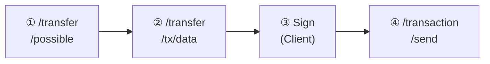

# Transfer API

Transfer API는 토큰 전송 기능을 제공합니다. **Operator** 권한이 필요합니다.

<Note>
  모든 전송은 송신자와 수신자 모두 KYC 등록이 완료된 상태여야 합니다.
</Note>

---

## 전송 가능 여부 확인

토큰 전송이 가능한지 사전에 확인합니다.

### Request

```bash
GET /main/v1/transfer/possible
```

### Query Parameters

<ParamField query="tokenSymbol" type="string" required>
  토큰 심볼
</ParamField>

<ParamField query="from" type="string" required>
  송신자 지갑 주소
</ParamField>

<ParamField query="to" type="string" required>
  수신자 지갑 주소
</ParamField>

<ParamField query="partition" type="string" required>
  파티션 ID
</ParamField>

<ParamField query="amount" type="number" required>
  전송 수량
</ParamField>

### Example

<CodeGroup>

```bash cURL
curl -X GET "https://api.stopulse.co.kr/main/v1/transfer/possible?tokenSymbol=PULSE-ST-001&from=0xAdb6Dc93FF5d5d93998e1643A03048C5437B08B7&to=0xFE3B557E8Fb62b89F4916B721be55cEb828dBd73&partition=0x0000...0001&amount=100" \
  -H "Authorization: Bearer {access_token}"
```

```javascript JavaScript
const params = new URLSearchParams({
  tokenSymbol: 'PULSE-ST-001',
  from: '0xAdb6Dc93FF5d5d93998e1643A03048C5437B08B7',
  to: '0xFE3B557E8Fb62b89F4916B721be55cEb828dBd73',
  partition: '0x0000...0001',
  amount: '100'
});

const response = await fetch(
  `https://api.stopulse.co.kr/main/v1/transfer/possible?${params}`,
  {
    headers: { 'Authorization': 'Bearer {access_token}' }
  }
);

const result = await response.json();
if (result.possible) {
  // 전송 진행
}
```

</CodeGroup>

### Response

```json 200
{
  "possible": true
}
```

전송 불가 시:

```json 200
{
  "possible": false,
  "reason": "INSUFFICIENT_BALANCE"
}
```

---

## 전송 트랜잭션 데이터 생성

토큰 전송을 위한 트랜잭션 데이터를 생성합니다.

### Request

```bash
POST /main/v1/transfer/tx/data
```

### Body Parameters

<ParamField body="tokenSymbol" type="string" required>
  토큰 심볼
</ParamField>

<ParamField body="partition" type="string" required>
  파티션 ID
</ParamField>

<ParamField body="from" type="string" required>
  송신자 지갑 주소
</ParamField>

<ParamField body="to" type="string" required>
  수신자 지갑 주소
</ParamField>

<ParamField body="amount" type="number" required>
  전송 수량
</ParamField>

<ParamField body="data" type="string">
  추가 데이터 (선택)
</ParamField>

### Example

<CodeGroup>

```bash cURL
curl -X POST "https://api.stopulse.co.kr/main/v1/transfer/tx/data" \
  -H "Authorization: Bearer {access_token}" \
  -H "Content-Type: application/json" \
  -d '{
    "tokenSymbol": "PULSE-ST-001",
    "partition": "0x0000...0001",
    "from": "0xAdb6Dc93FF5d5d93998e1643A03048C5437B08B7",
    "to": "0xFE3B557E8Fb62b89F4916B721be55cEb828dBd73",
    "amount": 100,
    "data": ""
  }'
```

```javascript JavaScript
const response = await fetch(
  'https://api.stopulse.co.kr/main/v1/transfer/tx/data',
  {
    method: 'POST',
    headers: {
      'Authorization': 'Bearer {access_token}',
      'Content-Type': 'application/json'
    },
    body: JSON.stringify({
      tokenSymbol: 'PULSE-ST-001',
      partition: '0x0000...0001',
      from: '0xAdb6Dc93FF5d5d93998e1643A03048C5437B08B7',
      to: '0xFE3B557E8Fb62b89F4916B721be55cEb828dBd73',
      amount: 100,
      data: ''
    })
  }
);
```

</CodeGroup>

### Response

```json 200
{
  "to": "0xContractAddress...",
  "data": "0xEncodedTransactionData...",
  "gas": "100000"
}
```

<Note>
  반환된 트랜잭션 데이터는 서명 후 `/transaction/send` API로 전송해야 합니다.
</Note>

---

## 파티션 간 전송 데이터 생성

동일 소유자의 다른 파티션으로 토큰을 이동하기 위한 트랜잭션 데이터를 생성합니다.

### Request

```bash
POST /main/v1/transfer/between-partitions/tx/data
```

### Body Parameters

<ParamField body="tokenSymbol" type="string" required>
  토큰 심볼
</ParamField>

<ParamField body="holder" type="string" required>
  토큰 보유자 주소
</ParamField>

<ParamField body="fromPartition" type="string" required>
  출발 파티션 ID
</ParamField>

<ParamField body="toPartition" type="string" required>
  도착 파티션 ID
</ParamField>

<ParamField body="amount" type="number" required>
  이동 수량
</ParamField>

### Example

```bash cURL
curl -X POST "https://api.stopulse.co.kr/main/v1/transfer/between-partitions/tx/data" \
  -H "Authorization: Bearer {access_token}" \
  -H "Content-Type: application/json" \
  -d '{
    "tokenSymbol": "PULSE-ST-001",
    "holder": "0xAdb6Dc93FF5d5d93998e1643A03048C5437B08B7",
    "fromPartition": "0x0000...0001",
    "toPartition": "0x0000...0002",
    "amount": 50
  }'
```

### Response

```json 200
{
  "to": "0xContractAddress...",
  "data": "0xEncodedTransactionData...",
  "gas": "100000"
}
```

---

## 전송 플로우



---

## 전송 불가 사유 코드

| 코드 | 설명 |
|------|------|
| `INSUFFICIENT_BALANCE` | 잔액 부족 |
| `SENDER_NOT_KYC_REGISTERED` | 송신자 KYC 미등록 |
| `RECEIVER_NOT_KYC_REGISTERED` | 수신자 KYC 미등록 |
| `TOKENS_LOCKED` | 토큰 잠금 상태 |
| `SAME_ADDRESS` | 송신자와 수신자 동일 |

---

## 에러 응답

| HTTP Status | 에러 코드 | 설명 |
|-------------|----------|------|
| 400 | `INVALID_ADDRESS` | 유효하지 않은 지갑 주소 |
| 400 | `INVALID_AMOUNT` | 유효하지 않은 수량 |
| 403 | `NOT_OPERATOR` | Operator 권한 없음 |
| 404 | `TOKEN_NOT_FOUND` | 토큰이 존재하지 않음 |
